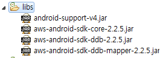

먼저 안드로이드 프로젝트에 라이브러리를 추가한다. 



MemberVo를 생성해준다. 

```
package com.example.multicall.vo;

import java.util.ArrayList;
import java.util.List;

import com.amazonaws.mobileconnectors.dynamodbv2.dynamodbmapper.*;

@DynamoDBTable(tableName = "Member")
public class Member {

	private String memberID;
	private String memberName;
	private String memberPhoneNumber;
	private ArrayList<String> memberFriendList;
	
	
	@DynamoDBAttribute(attributeName = "FriendList")
	public ArrayList<String> getMemberFriendList() {
		return memberFriendList;
	}

	public void setMemberFriendList(ArrayList<String> memberFriendList) {
		this.memberFriendList = memberFriendList;
	}

	@DynamoDBHashKey(attributeName = "memberID")
	public String getMemberID() {
		return memberID;
	}
	
	public void setMemberID(String memberID) {
		this.memberID = memberID;
	}
	
	@DynamoDBAttribute(attributeName = "MemberName")
	public String getMemberName() {
		return memberName;
	}
	
	public void setMemberName(String memberName) {
		this.memberName = memberName;
	}
	
	@DynamoDBAttribute(attributeName = "MemberPhoneNumber")
	public String getMemberPhoneNumber() {
		return memberPhoneNumber;
	}
	
	public void setMemberPhoneNumber(String memberPhoneNumber) {
		this.memberPhoneNumber = memberPhoneNumber;
	} 
}
```

내 AWS 계정과 연결할 credential 생성한다.
