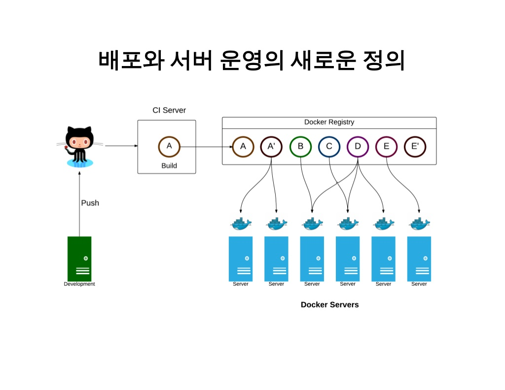
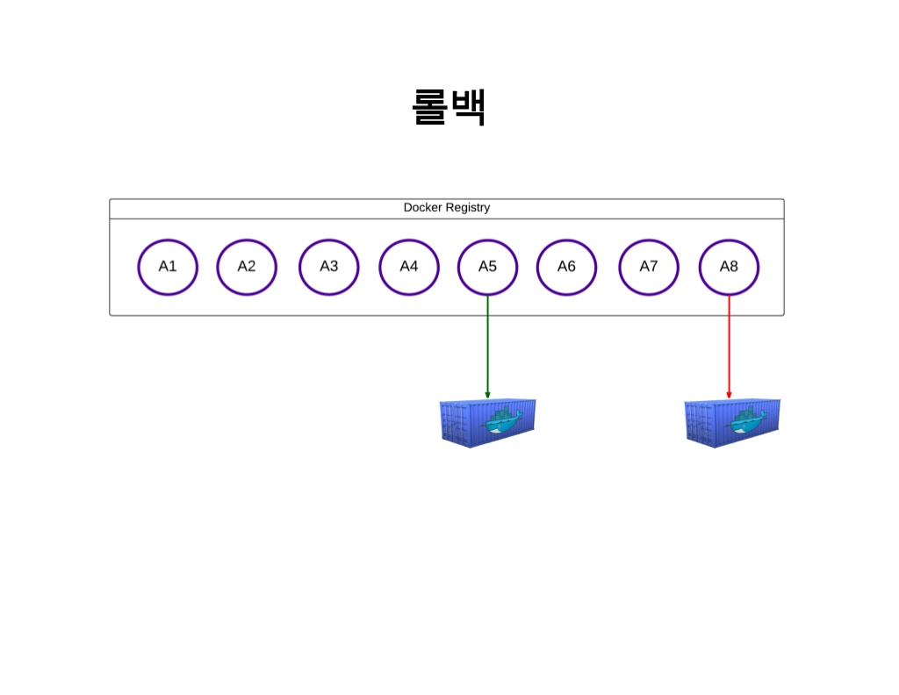

### Docker를 사용하지 않는 경우

1. 서버운영이 어렵다. 
    1. 우리는 최소 10개의 라즈베리파이 서버를 운영 해야한다.
    2. 다수의 애플리케이션을 동작하는 상태를 유지하도록 하는게 서버운영인데, 서버운영이 어려운 이유는 전역적인 상태 관리를 해줘야 하기 때문이다.
2. 서비스 운영환경의 변화가 빈번하다.(백업의 필요성 대두) 
    1. 스파크, 파이썬, DB 등 새롭게 적용하는 요소들이 많기 때문에 그에 다른 수많은 수행착오가 발생한다. 
    2. 설정을 잘못함으로써 운영체제를 밀고 다시 설치하는 등의 큰 리스크가 자주 발생할 수 있다.
    3. 그때마다 다시 환경세팅을 하려면 시간/노력이 많이든다. 
3. 가상 이미지를 만들어 복사해서 쓰는 방법은 어떤 특정 시점의 상태를 저장한거기 때문에 이미지 변화에 대한 능동적인 대처가 어렵다. 
4. 가상 이미지 방법은 이미지안에 OS가 들어가기 때문에 무겁고 Guest OS로써 메모리접근, 파일시스템, 네트워크 속도가 느리다. 

---

### Docker를 사용한 경우 

1. 서버 운영이 쉬워진다. 
    
2. Docker Hub을 통해서 이미지를 github처럼 버전관리가 가능하다.
    
3. 현재는 라즈베리파이로 하지만 서버가 어떤 것이든 빠른 이동 및 확장이 가능하다. 
4. 이미지에 OS가 없기 때문에 용량이 크게 줄었고, 하드웨어를 가상화하는 계층이 없기 때문에 메모리 접근, 파일시스템, 네트워크 속도가 월등히 빠르다. 
5. 리눅스/유닉스 계열은 파일 실행에 필요한 모든 구성요소가 잘게 쪼개져 있다. 이는 시스템 구조가 단순해지고 명확해지는 장점이 있지만 의존성 관계를 해결하기가 어려워지는 단점이 있다. 그래서 리눅스 배포판 별로 미리 컴파일된 패키지라는 시스템이 나왔지만 서버를 실행할 때마다 일일이 소스를 컴파일 하거나 패키지를 설치하고, 설정하려면 상당히 귀찮다. 서버 구성을 미리 해놓은 Docker 이미지를 사용하면 실행할 서버가 몇 개가 되든 손쉽게 해결할 수 있다.     