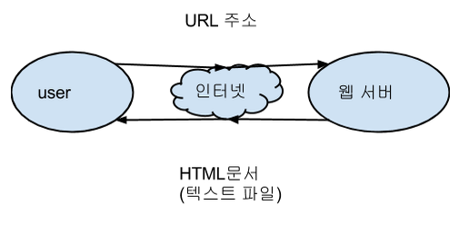
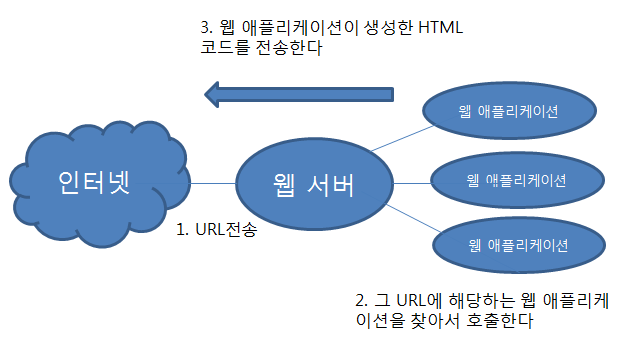
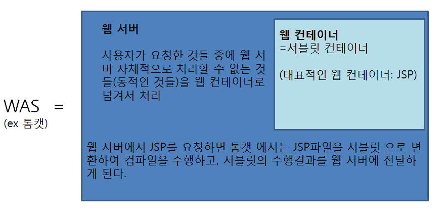

**CGI(Common Gateway Interface)프로그램이란? ** 
엄밀히 말하면 웹 서버는 동적인 데이터를 처리 할 수 없다. 그때 동적 처리를 수행하기 위해서 존재하는 프로그램, 그것을 게이트웨이 프로그램이라고 부른다. 왜냐면 HTTP 서버 시스템 상에 있는 웹 및 다른 자원(DB 등) 사이의 통로 역할을 하기 때문이다.

**Apache와 Apache Tomcat의 차이** 
웹 서버 : 정적인 data를 보냄 
웹 애플리케이션 서버(WAS) : 동적인 data를 보냄  
=컨테이너 
=웹 컨테이너 
=서블릿 컨테이너  

웹서버로 많이 쓰는 프로그램 : Apache, IIS  
웹 애플리케이션 서버로 많이 쓰는 프로그램 : Apache Tomcat 

Apache Tomcat = Tomcat의 WAS기능 + Apache의 웹 서비스 데몬 기능  
(Tomcat이 Apache의 모든 기능을 포함하고 있지 않다) 

성능향상을 위해 Apache는 웹 서버 역할, Tomcat은 WAS 역할? 답은 No  
톰캣 하나만 웹서버로 해도 성능에 큰 차이가 없다. (톰캣 5.5부터 Httpd의 native모듈을 사용하기 때문에 동적인 페이지 뿐만 아니라, 정적인페이지 또한 처리가 가능)  
톰캣은 JSP/서블릿 컨테이너 중 하나로써, 사용자에게 JSP 요청을 받으면 서블릿으로 바꾸어 이를 실행하는 역할을 한다.  

**웹 서버와 웹 애플리케이션의 차이 **

웹 서버 : 웹 브라우저로부터 URL을 받아서 그에 해당하는 HTML 문서를 찾아 웹 브라우저로 보내주는 것  

웹 애플리케이션 : 웹 서버가 HTML 문서를 생성하는 프로그램을 호출해서 그 프로그램의 실행 결과를 보내주는 일을 하는데 이때 호출되는 프로그램을 웹 애플리케이션이라 한다.

웹 애플리케이션이 생성하는 HTML 문서를 동적 HTML 문서라고 하고 웹 서버 쪽에 파일로 저장되어 있는 HTML 문서를 정적 HTML 문서라고 한다.

Q) 웹 애플리케이션은 웹 서버와 동등하게 실행되는 독립적인 프로그램인가, 아니면 웹 서버에 종속된 모듈인가?  
A) 두 가지 형태가 모두 존재한다  
1. 최초의 웹 애플리케이션 기술인 CGI(Common Gateway Interface)에서는 웹 서버와 동등하게 실행되는 독립적인 프로그램 형태로 작성. 그러한 경우 시스템 자원이 많이 필요하고 운영체제에 의해 별개로 취급되는 CGI프로그램의 실행 흐름을 웹서버가 적절하게 제어할 수 없어서 웹 서버로 아주 많은 URL요청이 한꺼번에 들어오면 너무 많은 CGI프로그램이 동시에 실행되어서 컴퓨터 전체가 다운되는 일이 빈번히 발생

2. 웹 서버의 모듈 형태로 웹 애플리케이션을 만듦 ex) 서블릿
 
서블릿 : 자바를 기반으로 하는 웹 애플리케이션 프로그래밍 기술.  자바 클래스 형태로 웹 애플리케이션을 작성하는데, 그 클래스를 서블릿 클래스라고 함

1. 서블릿 클래스의 소스 코드를 작성한다.
(doGet이나 doPost 라는 메소드 선언하고 ( HttpServeltRequest, HttpServeltResponse 파라미터 가짐) 그 안에 작성 )
2. 작성한 소스코드를 컴파일한다.
3. 결과를 웹 서버의 디렉토리에 저장한다.
4. 서블릿 클래스를 웹 서버에 등록한다. 

JSP(Java Server Pages) : 서블릿과 마찬가지로 자바를 기반으로 하는 웹 애플리케이션 프로그래밍 기술. 서블릿 클래스와 반대로 HTML 문서에 자바 코드가 삽입되는 구조  
<% ~ %> or <%= ~ %> 사이에 자바 명령문을 작성하는데 이 코드는 웹 브라우저로 전송되는 것이 아니라 웹 서버 쪽에서 실행됨(웹 서버 쪽에서 계선되고 그 결과만 웹 브라우저로 전송)  

1. JSP페이지를 작성한다.
2. JSP 페이지를 웹 서버의 디렉토리에 저장한다 

웹 서버 안에서 서블릿과 JSP를 지원하는 부분을 웹 컨테이너라고 한다. 

**웹 애플리케이션 서버** : 인터넷 상에서 HTTP를 통해 사용자 컴퓨터나 장치에 애플리케이션을 수행해주는 미들웨어(소프트웨어 엔진)이다. 웹 애플리케이션 서버는 동적 서버 콘텐츠를 수행하는 것으로, 일반적인 웹 서버와 구별이 되며, 주로 데이터베이스 서버와 같이 수행이 된다.  
Servlet, ASP, JSP, PHP 등의 웹 언어로 작성된 웹 애플리케이션을 서버 단에서 실행된 후 실행 결과 값을 사용자에게 넘겨주게 되고, 우리가 가진 브라우저가 결과를 해석해서 화면에 표시하는 순으로 동작한다.

**미들웨어** : 분산 컴퓨터 환경에서 서로 다른 기종 간의 서버와 클라이언트들을 연결해 주는 중계 소프트웨어. 
애플리케이션들을 연결해 이들이 서로 데이터를 교환할 수 있게 중계 역할을 하는 소프트웨어이다. 즉, 시스템 소프트웨어와 응용 소프트웨어 사이 또는 두 가지 다른 종류의 응용 프로그램 사이에서 조정 및 중계 역할을 하는 프로그램을 일컫는 말이다.

**웹 서버와 웹 애플리케이션 서버의 차이 및 구성**  
웹 서버는 정적 데이터를 처리하는 용도로, 웹 애플리케이션 서버는 동적 데이터를 처리하는 용도로 사용한다. 하지만 톰캣의 경우처럼 웹 애플리케이션 서버에 웹 서버 기능이 포함된 서버 프로그램도 존재한다. 간단한 웹 사이트를 구축한다면 웹 서버와 웹 애플리케이션 서버를 구분 지어 사용할 필요가 없다. 톰캣 하나로도 충분 !!

애플리케이션 서버는 분산 네트웍 내의 컴퓨터 내에서 응용프로그램에 비즈니스 로직을 제공하는 서버 프로그램이다. 애플리케이션 서버는 GUI서버, 애플리케이션(또는 비즈니스 로직)서버, 그리고 데이터베이스 및 트랜잭션 서버로 구성되는 3 계층 클라이언트/서버 모델의 일부로 자주 사용된다. 
1. 첫번째 계층, 즉 프론트엔드에는 대게 PC나 워크스테이션에서 웹 브라우저 기반의GUI
2. 두번째 계층, 비즈니스 로직 애플리케이션 
3. 세번째 계층, 즉 벡엔드에는 데이터베이스 및 트랜잭션 서버가 자리

애플리케이션 서버는 브라우저 기반의 프론트엔드와 데이터베이스 시스템의 백엔드 사이에 존재하는 일종의 중개인이라고도 볼 수 있다. 
많은 경우에서, 애플리케이션 서버는 웹 서버(HTTP 서버)와 결합되거나 함께 일하는데, 이러한 것을 WAS(웹 애플리케이션 서버)라고 부른다.  웹 브라우저는 사용자를 위해 만들기 쉬운  HTML 기반의 프론트 엔드를 지원한다. 웹 서버는 애플리케이션 서버에 작업요구를 전달하고, 또한 수정되었거나 새로운 웹 페이지를 사용자에게 되돌려주는데 있어 몇가지 다른 방법들을 제공한다. 이러한 접근 방식중 하나가 JSP

**웹 컨테이너** : 웹 애플리케이션을 실행해주는 도구(SW). 톰캣이 웹 컨테이너 역할을 한다. 요즘 톰캣의 능력이 좋아져서 웹 서버 역할도 일부 수행하기 때문에 WAS의 예로 톰캣을 들기도 함 
