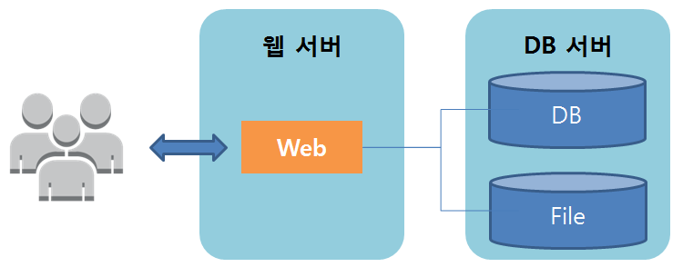
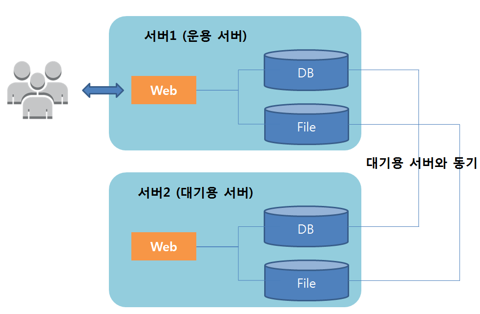
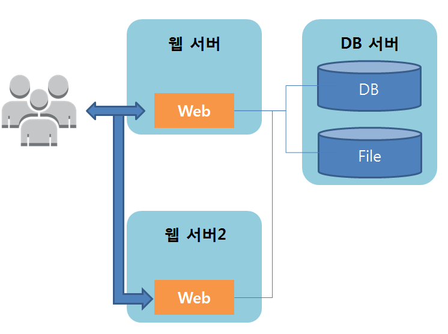
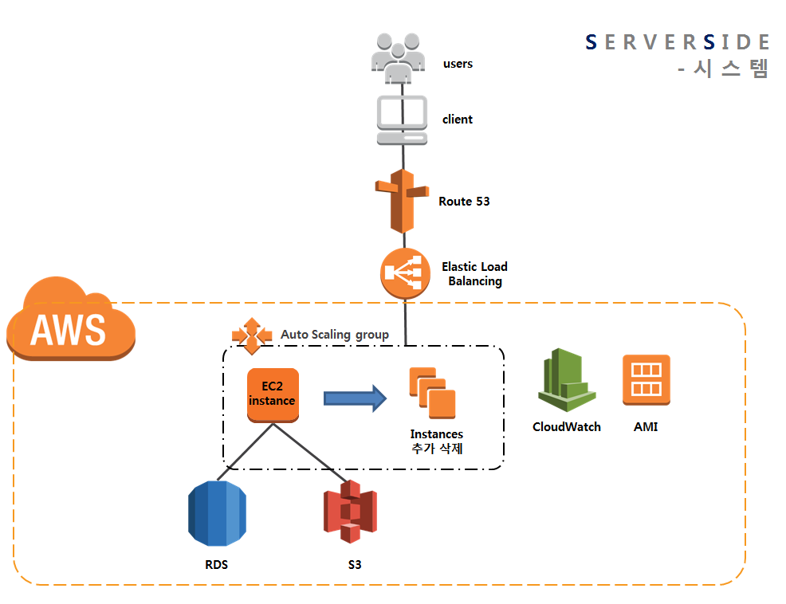
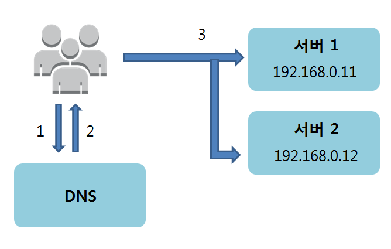

##시스템 구성 변경의 기초 

**패턴1 : 웹서버 x1, 데이터베이스 서버 x1 구성** <br>


**패턴2 : 웹서버 x2 구성 -다중화**<br>

이 구성은 다중성을 높이기 위해 적용하는 경우가 많다. 서버1에 어떤 문제가 생긴 경우, 서버1 대신 서버2를 이용하는 방법이다. <br>
이때 현재 운용 중인 서버와 대기용 서버 간의 전환 방법은 다음과 같이 다양하다. <br>
```
물리적인 서버의 경우, LAN 케이블을 바꿔 끼운다(수 시간)
DNS를 갱신한다(수 분 ~ 수 시간)
대기용 서버의 IP 주소를 수동으로 갱신한다(수 분 ~ 수 시간)
대기용 서버의 IP 주소를 자동으로 갱신하는 제품을 도입한다(수 초 ~ 수분)
그 밖에도 로드밸런서를 별도로 준비하는 방법이 있다
```
전제조건으로 DB와 File은 어떤 방법으로든 데이터를 동기화 해야하며, 그 방법은 다양하다 <br>
예를 들면, DBMS의 기능을 이용하거나 공유 스토리지(HW 및 SW)를 이용하는 방법이 있다 <br>

또한, 동기 방식으로는 완전 동기, 비동기 등이 있기 때문에 설계할 때 특히 주의해야 한다. 완전 동기는 성능을 높이기 어렵고,비동기는 성능을 높이기 용이하지만 비동기 특유의 동기 방법에 주의할 필요가 있다.<br>

참고로, 데이터 동기의 방법으로서 하드디스크 자체를 공유하는 방법도 있지만 전용 디스크 장치 및 케이블 등이 필요하게 되므로 가격이 매우 비싸진다. 따라 웹 계열의 시스템에서는 잘 사용하지 않는다. <br><br>

**패턴3 : 웹서버 x2, 데이터베이스 서버 x1 구성 - 다중화, 기능분할, 스케일 아웃**<br>


<br>
이 구성은 패턴 1에서 Web 측의 성능 문제가 해결 되지 않을 때 적용하는 경우가 많다.<br><br>
Web은 시스템의 동작을 일일이 계산해서 처리하게 되며, 사용자 수에 따라 처리량이 증가되기 쉽다. 따라서, Web과 DB를 별도의 서버로 나누어 분업시킴으로써 서버의 리소스 편중에 따른 성능 저하를 피하고, Web서버도 2대로 나누어 사용함으로써 시스템 전체의 성능을 향상시킨다. <br><br>
하지만, 1대의 서버로는 감당할 수 없을 만큼 액세스 수가 많은 경우, 2대의 구성에서는 1대가 고장 나면 또다시 처리 능력이 부족하게 되므로 가용성 관점에서는 여전히 문제가 된다.<br><br>

**패턴4 : 웹서버 x2, 데이터베이스 서버 x2구성 - 다중화, 기능분할, 스케일 아웃**<br>

이 구성으로는 Web의 다중화와 부하 분산 그리고 DB의 다중화를 할 수 있다. <br>

참고로, 대기용 서버의 DB에 대해 참조 SQL을 발행하여 데이터를 취득하는 것은 가능하지만, 부하의 관점에서는 의미가 없으며 가용성이 떨어지기 때문에 사용 하지 않는 것이 좋다. 

현재 운용 중인 서버만으로 처리하기 어렵다면, File을 별도의 서버로 분할 하여 대기용DB(slave)를 3대 이상 준비하는 등의 대책을 수립하는 것이 좋다. 

**내가 구축한 웹 서비스 시스템 구성도 **

EC2스펙은 t2.micro이고 CPU사용률 80%이상 시 CloudWatch가 감지하여 AUto Scaling하였다.<br>
최대 EC2 인스턴스 3개로 제한했다.

최소한으로 사용한다고 설정했는데 EC2 AutoScaling기능과 RDS에서의 Read Replica기능 때문에 
꽤 많은 요금이 청구되었다. <br>
P.S Route53의 $0.51은 도메인 등록 시 청구되는 요금


##부하분산(로드밸런싱)의 기초 지식  
로드밸런싱의 구현방법 : 로드밸런서를 사용, DNS 라운드로빈을 사용 

DNS 라운드로빈은 클라이언트 측의 동작에 의존적인 방법이다. <br>


1. 클라이언트로부터 DNS 서버로 질의 
2. DNS 서버로부터 클라이언트로 응답
3. 대개의 클라이언트(OS, 브라우저)는 첫 번째 IP주소를 이용. 보통의 브라우저는 첫 번째 IP주소에 접속할 수 없는경우, 두번째 IP 주소로 다시 시도하게 되어 있다. <br>

그렇기 때문에 시템을 이용하는 사용자의 IS나 브라우저의 버전에 따라 기대했던 분산의 효과나 가용성의 향상 효과를 얻지 못할 수도 있다. 

**로드밸런서 vs DNS 라운드 로빈** <br>

로드밸런서의 이점은 의도한 대로 확실하게 분산할 수 있다는 것이다. 로드밸런서와 복수의 웹 서버를 활용하면 서비스를 중지하지 않고도 업데이트 등을 할 수 있으며, 일반 사용자로부터의 액세스 이외에도 다양한 곳에 사용할 수 있다. 다만, 로드밸런서가 단일 장애 포인트가 되지 않도록 로드밸런서의 다중화도 고려해야 한다. 또한 로드밸런서가 보틀넥이 된 경우에는 로드밸런서의 성능을 높일 필요가 있다. <br>

DNS 라운드로빈의 이점은 추가 설비가 필요하지 않다는 것이다. 이렇게 설비를 최소화함으로써 고장률이나 단일 장애 포인트와 같은 걱정을 크게 줄일 수 있지만, 문제 발생 시 장비의 신속한 전환은 기대하기 어렵다. <br>

따라서 기본적으로는 로드밸런서를 이용하면서 DNS 라운드로빈을 적당히 함께 사용하는 것이 좋을 것이다.<br>

**로드밸런서와 분산 목적지 연결 방식 **<br>
로드밸런서는 크게 L4-NAT, L4-DSR, L7의 세 종류가 있다. L4 로드밸런서는 OSI 참조 모델에서 말하는 제 4계층(TCP, UDP)까지를 처리하고, L7 로드밸런서는 제 7계층(HTTP, SMTP 등)까지를 모두 처리한다. L4와 L7을 비교하자면 L4가 처리하는 계층이 조금 더 좁기 때문에 처리량이 줄어들어 로드밸런서가 부하의 보틀넥이 되기는 어렵다. 이에 반해 L7은 고기능인 만큼 L4와 비교하면 부하의 보틀넥이 되기 쉽다.

L4-NAT는 Network Address Translation의 약자로 IP 주소를 변환하는 것을 말한다. 엄밀하게는 IP 주소와 함께 통신에 사용하는 포트 번호까지 변환하는 NAPT를 사용하는 경우가 많으며 매우 일반적인 방식이다. 

L4-DSR은 수 Gbps가 넘는 대량의 트래픽이 발생하는 시스템에서 사용한다. 네트워크적으로 조금 까다로운 구현을 통해 응답 패킷이 로드밸런서를 통하지 않게 하여 로드밸런서가 보틀넥이 되지 않도록한다.

L7 로드밸런서는 '리버스 프록시'라고 하기도 한다. L4-NAT와 같은 구조이지만 OSI 7계층까지 처리하기 때문에 고기능의 처리를 할 수 있다. 예를들면, 응답을 캐시하거나, SSL의 종단이 되거나, 응답이 500에러인 경우에는 서버 대신에 에러화면을 표시하는 것도 가능하다. 

우선은 L4-NAT나 L7을 검토한 다음, 만족되지 않을 경우에 L4-DSR이나 DNS 라운드로빈을 검토하는 것이 좋다. 

**로드밸런서에서의 분산 목적지 결정 방법**

엑세스를 분산하는 대표적인 방식은 아래와 같다.<br>
```
라운드로빈
가중 라운드로빈
최소 커넥션
가중 최소 커넥션
```

<br>
라운드로빈을 사용한 경우, 기본적으로는 특별히 아무것도 신경 쓰지 않고 분산 목적지 목록에 있는 순서대로 엑세스를 분산한다. 라운드로빈은 무척 간단하여 알기 쉬운 반면, 분산 목적지 서버의 상태를 고려하지 않기 때문에 어떠한 이유인지와 상관없이 일시적으로 부하가 높아진 서버로도 액세스를 분산해 버린다. 

가중 라운드로빈은 기본적으로 라운드로빈과 같은 방식이지만, 지정한 가중치에 따라 특정 분산 목적지에 많게 또는 적게 엑세스를 분산한다. 예를들어 '서버1 : 서버2 : 서버3 : 서버4 = 1: 2: 2: 2'의 가중치인 경우 서버 2~4에는 서버 1의 2배 만큼 액세스를 분산시킨다. 가중치의 기준은 서버의 스펙이 동일하지 않은 경우 서버의 스펙에 따라 적절한 양의 처리를 부담시키기 위해 이용한다. 

최소 커넥션은 접속 수가 적은 서버에 액세스를 분산한다. 

<br>
이 경우, 최소 커넥션에서는 서버1에 우선적으로 액세스를 분산한다. 

위와 같은 접속 수의 상황에서 가중 최소 커넥션이 '서버1 : 서버2 : 서버3 : 서버4 = 1: 2: 2: 2'라고 한다면 이 경우에는 4개의 서버에 동일한 확률로 액세스가 분산된다.


대부분의 웹 사이트 접속은 짧은 시간 내에 종료되고 접속이 끊어진다. 따라서 접속 수의 변동이 심해 밸런스가 다소 흔들릴 수 있지만 이런 미세한 것들은 신경 쓰지 않도록 하자. 

**로드밸런서의 헬스체크기능**<br>
일정 간격으로 분산 목적지의 응답 여부를 확인하여 응답이 없는 분산 목적지를 제외하는 기능<br>
응답 여부를 확인하는 간격을 헬스체크 인터벌이라고 하며, 헬스체크 인터벌 + 헬스체크 자체에 소요되는 시간 동안에 분리가 완료된다. 