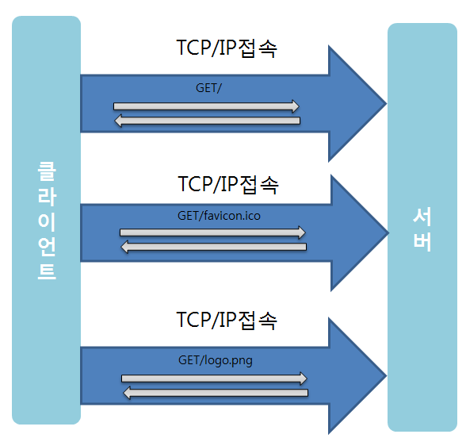
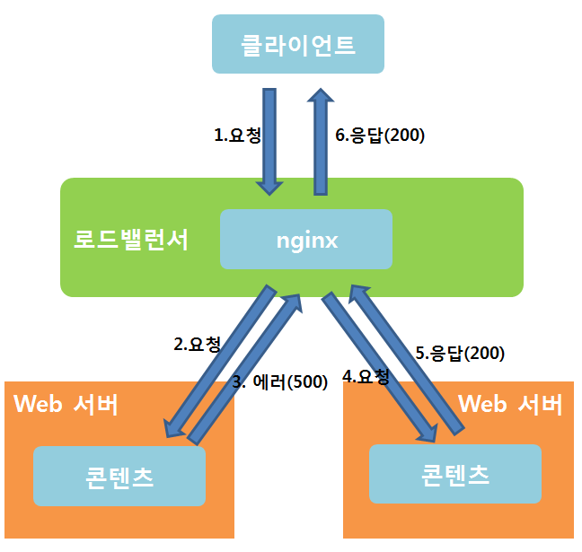
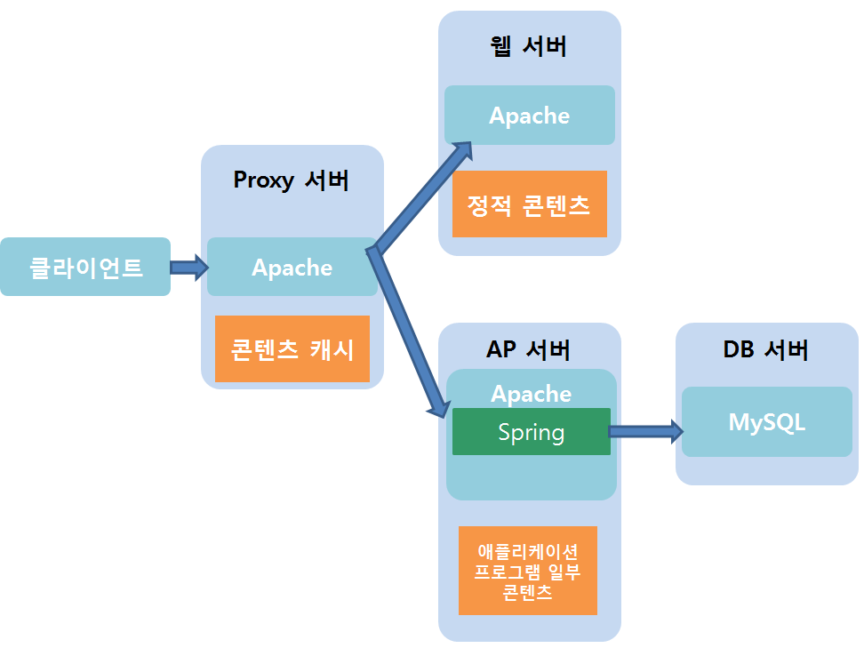

**요청 횟수와 데이터 전송량을 줄이는 방법**

| 요청 횟수를 줄이는 방법 | 구체적인 실행 방법 |
| -- | -- |
| 파일 결합에 의한 이미지 수 감소 | 페이지 내에서 이용하는 CSS나 JavaScript의 파일을 결합해 하나로 집약함으로써 1페이지에선의 요청 수를 줄인다. |
| CSS Sprite에 의한 이미지 수 감소 | 이미지 하나로 집약하여 1페이지에서의 요청 수를 줄인다. |
| 배경 등의 표현을 CSS로 구현 | 이미지 수를 줄임으로써 1페이지에서의 요청 수를 줄인다. 데이터 전송량도 줄일 수 있다. |
| HTTP KeepAlive 유효화 | HTTP KeepAlive를 유효화하여 다수의 요청을 한번의 통신으로 처리함으로써 통신 횟수를 줄일 수 있다. |

**HTTP KeepAlive : ** 하나의 TCP/IP 접속을 유지한 채로 다수의 HTTP 요청을 처리 할 수 있다.</br>



HTTP KeepAlive를 사용하지 않는 경우에는 위 그림과 같이 각각의 요청에 대해 하나씩 접속해야 한다. 


HTTP KeepAlive를 사용하면 위와 같이 하나의 접속을 다수의 요청에서 공유한다. HTTP KeepAlive의 이점은 매번 접속할 필요가 없기 때문에 서브 측과 클라이언트 측 모두 처리량이 줄어들어 사이트 표시가 빨라질 수 있다는 것이다. </br> 한편, 서버 측은 다음 요청이 올 수도 있기 때문에 일정 시간을 대기하게 되므로, 그만큼 접속을 유지해야만 한다. 따라서 서버 측의 병렬 수 는 많아진다.

Apache에서 KeepAlive 설정법 <br>
```
KeepAlive On
MaxKeepAliveReq uests 200
KeepAliveTimeout 2
```

<br>

| 데이터 전송량을 줄이는 방법 | 구체적인 실행 방법 |
| -- | -- |
| CSS나 JavaScript를 minify한다. | 들여쓰기나 행 바꿈을 없애는 등 CSS나 JavaScript의 파일 내용을 줄인다. |
| 이미지의 압축률을 높인다. | 이미지의 압축률을 높여 파일 용량을 작게 한다. |
| 이미지의 크기를 작게 한다. | 이미지의 크기가 표시될 크기보다 큰 경우 크기에 맞게 바꿈 |
| 데이터를 압축하여 전송한다. | 전송 시에 데이터를 gzip 압축하여 전송한다. |
| 정적 파일을 브라우저에서 캐시한다. | HTTP 헤더를 설정하여 정적 파일을 브라우저에서 캐시함으로써, 갱신의 확인만으로 요청의 처리를 끝낸다. |
| CDN을 사용한다. | CDN에서 데이터를 캐시함으로써 자체 서버의 데이터 전송량을 줄인다. |

<br>
**CDN(Content Delivery Network)서비스 : ** 콘텐츠(HTML, 이미지, 동영상, 기타파일)를 사용자들이 빠르게 받을 수 있도록 전 세계(or 전국) 곳곳에 위치한 캐시 서버에 복제해주는 서비스<br>

**톰캣의 JDK 튜닝해야하는 이유 : **기본적으로 톰캣7은 256MB 힙을 포함한다. 그러나 최신 애플리케이션은 점점 많은 램을 요구한다. 

**톰캣7의 힙 크기를 증가시키는 방법 ** <br>
TOMCAT_HOME/bin에 위치한 catalina.sh파일에 JAVA_OPTS 파라미터를 추가한다 <br>
(JVM 파라미터 설정 바꾸면 톰캣 서버 재시작해야 새로운 값 적용됌)<br>

JAVA_OPTS="-Xms128m -Xmx512m -XX:MaxPermSize=256m" <br>
합의 크기를 256MB에서 512MB로 증가시키며, 영구 세대(클래스 정의와 관련 메타데이터를 저장하는 힙의 영역)크기도 256MB로 설정<br>

-XX:MaxNewSize=size : 신세대의 최대 크기(바이트 단위)<br>
-XX:MaxPermSize=64m : 영구 세대의 크기(-Xmx 값을 초과했을 때)<br>
-Xms : 톰캣 시작시 최소 힙 메모리 <br>
-Xmx : 인스턴스에 할당할 최대 메모리 <br>
-Xss : 힙의 스택 크기 <br>

**[Web]을 스케일 아웃 할때의 주의점**<br>
사용자 한 명의 연속된 액세스가 다수의 서버로 분산 될 수도 있다.<br>
ex)이미지 업로드'기능이 입력, 화긴, 완료의 세 가지 화면으로 나뉘어져 있을 때 입력 화면의 업로드 버튼 요청과 확인 화면의 확인 버튼 요청은 각각 다른 서버에서 처리될 가능성이 있다. 

따라서 아래와 같은 검토가 필요하다 <br>
1. 세션 정보를 공유 <br>
    - 세션 정보를 공유하면 분산 목적지 서버가 바뀔 때마다 로그아웃되거나 입력 내용이 지워지는 등의 문제를 피할 수 있다.<br>
2. 다수의 요청을 초과하는 임시 파일을 작성하지 않거나 서버 간에 공유<br>
    - 임시 파일을 작성하지 않거나 서버 간에 공유를 하면 업로드 처리를 할 수 없는 경우가 생기는 문제를 피할 수 있다.<br>

세션 정보 공유의 실행 방법은 'memcached'와 같은 KVS로 실시간 공유하는 것이 일반적이다.<br>
NFS로 세션 파일을 공유하고 RDBMS로 실시간 공유하는 방법도 있지만 성능 관리가 어려워지기 때문에 별로 이용하지 않음 

다수의 웹 서버에 액세스를 분산시키는 방법 중에서 로드밸런서나 Proxy로 nginx를 이용한 경우, 백엔드가 에러 응답일 때 즉시 사용자에게 에러 응답을 하지 않고 다음의 백엔드로 요청을 돌리는 기능이 있어 매우 편리하다.<br>



---
<br>
**[DB]를 스케일 아웃 할때의 주의점 **<br>
Master DB에만 쓴다.<br>
Slave DB로의 데이터 반영에는 지연이 발생한다<br>

데이터 반영에 지연에 있어, 예를 들어 전자상거래 사이트의 화면 표시에서 재고 수량을 수정할 때 재고 수량을 Slave DB에서 읽어오고 Master DB에서 수정한다면 처리 요구가 병행될 때 재고 수량이 잘못 반영될 가능성이 있다. <br>

갱신 처리는 결국 모든 서버에서 실행되기 때문에 기본적으로 Slave는 2대 이상이 되어야만 성능 향상에 효과가 있다. 

MySQL 5.6의 기본값은 'STATEMENT'이다. 이 경우 리플리케이션할 수 없는 SQL은 사용하지 않도록 해야 한다. 구체적으로 이에 해당하는 패턴은 아래와 같다. 
1. 'order by'가 없는데 'limit'가 있는 'update'나 'delete' sql
2. 'LOAD_FILE()', 'SYSDATE()', 'RAND()' 등의 함수


---

<br>
이 책에서 소개하는 서버 분할 아키텍처 <br>


아직 잘 이해가 안가는 부분은 웹 서버가 정적 콘텐츠를 처리하는 부분이다. <br>
여지껏 내가 알고 있었던거랑은 달라서 좀 더 찾아봐야할듯 <br> 
