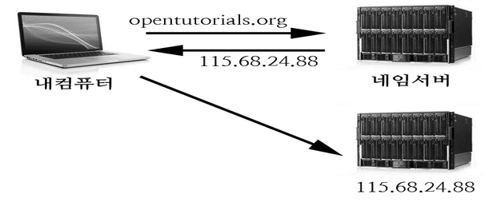
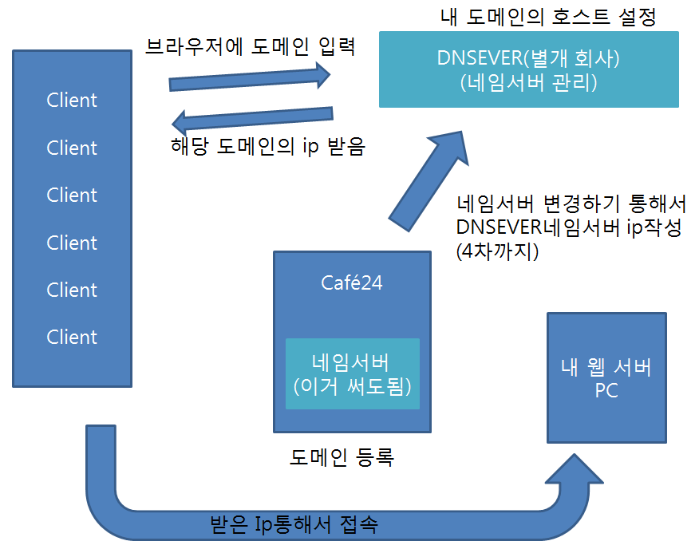
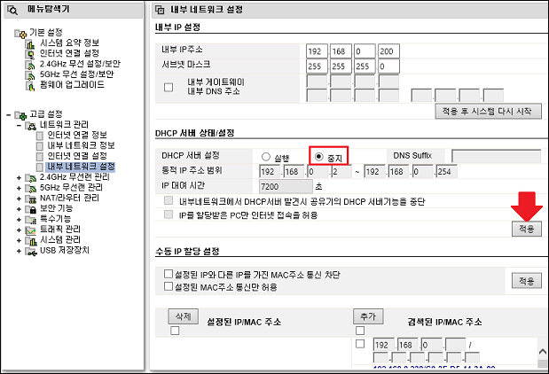
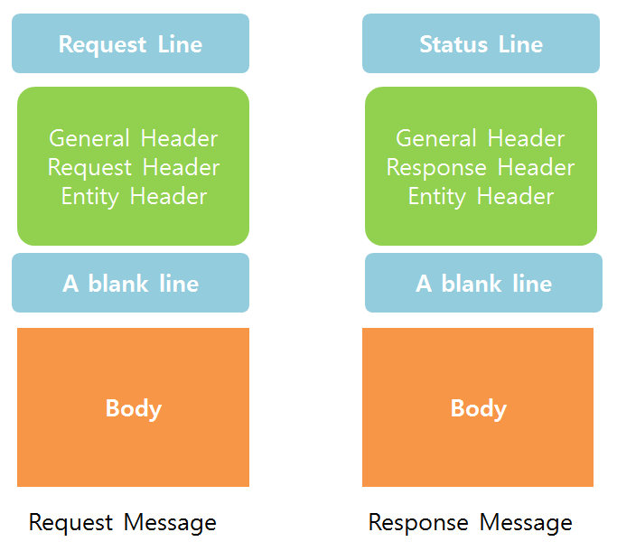

###네임서버
도메인에 해당하는 IP를 알려주는 서비스</br>


**호스트 설정**</br>
호스트 : 네트워크에 연결되어 있는 컴퓨터들을 호스트라고 한다. </br>
호스트 설정 : 도메인을 호스트의 IP에 연결하는 행위 </br>
하나의 도메인으로 여러개의 호스트에 연결하기</br>


**호스트 파일** </br>
호스트 파일을 이용하면 특정 도메인에 해당되는 ip를 직접 자신의 컴퓨터에 셋팅할 수 있다. </br>
브라우저가 도메인에 해당하는 IP를 찾는 순서 
1. local cache안에 ip가 있는지 체크하고 
2. 없으면 hosts 파일 검색하고
3. 그래도 없으면 DNS서버를 검색해서 알려주고 ip로 접속 

한번이라도 접속을 하면 local cache에 저장이 됨 

**실제 네임서버 흐름도**


</br>
**사설 IP 주소로 이용할 수 있는 IP주소 **
10.0.0.0 ~ 10.255.255.255 : 매우 큰 규모의 네트워크용</br>
172.16.0.0 ~ 172.31.255.255 : 중간 규모의 네트워크용 </br>
192.168.0.0 ~ 192.168.255.255 : 작은 규모의 네트워크용 </br>


DHCP : 예를들어 IPtime에서 동적으로 사설 IP를 할당해주는 프로토콜 (Dynamic Host Configuration Protocol)



Failover : 1차 시스템이 고장 또는 정기 유지보수 등의 이유로 이용할 수 없는 상태가 되었을 때, 2차 시스템이 즉시 그 임무를 넘겨받아 프로세서, 서버, 네트웍 또는 데이터베이스 등과 같은 시스템 구성요소의 기능들이 중단 없이 유지될 수 있는 백업 운전 모드를 말한다.

CDN : 접속자가 인터넷상에서 가장 가까운 곳의 서버로 컨텐츠를 전송받아 트래픽이 특정 서버에 집중되지 않고 각 서버로 분산되도록 하는 기술. 
여러곳의 IDC에 동일한 컨텐츠를 올려놓고, 접속자가 사용하는 인터넷전용회선의 종류에 따라 가장 가까운 곳에서 콘텐츠를 불러들일 수 있도록 지원하는 서비스 
콘텐츠(HTML, 이미지, 동영상, 기타파일)를 사용자들이 빠르게 받을 수 있도록 전 세계 곳곳에 위치한 캐시 서버에 복제해주는 서비스 

Host file : hosts 파일을 이용하면 특정 도메인에 해당되는 ip를 직접 자신의 컴퓨터에 셋팅할 수 있다. 
브라우저가 도메인에 해당하는 IP를 찾는 순서 
local cache안에 ip가 있는지 체크하고 
없으면 hosts 파일 검색하고
그래도 없으면 DNS서버를 검색해서 알려주고 ip로 접속 
 
한번이라도 접속을 하면 local cache에 저장이 됨 

###HTTP 프로토콜 내부 들여다보기 

1. 웹 브라우저는 URL에 명시된 서버의 주소(IP주소와 포트 번호)로 연결한다. 
2. 웹 브라우저와 웹 서버 사이에 통신인 채널이 연결되면, 웹 브라우저는 내부적으로 HTTP규약을 따르는 요청 메세지(Request Message)를 생성해서 웹 서버로 전송한다. 요청 메세지는 요청라인(Request Line), 요청헤더(Request Header), 바디(Body) 등으로 구성되어 있다. 
3. 웹 서버는 웹 브라우저로부터의 요청 메세지를 분석하고 해당하는 문서를 찾는다. HTTP 규약에 부합하는 응답 메세지(Response Message)를 구성해서 웹 브라우저에게 전송한다. 응답 메세지는 상태라인(Status Line), 응답헤더(Response Header), 바디(Body) 등으로 구성된다. 여기서 응답 헤더는 성공/실패 여부, 전송할 데이터 유형(텍스트, 이미지, 동영상 등)으로 구성되며, 실제 데이터는 응답 헤더에 이어서 전송한다. 
4. 웹 서버는 응답 메세지를 전송한 직후, 강제로 연결을 종료한다. 
5. 웹 브라우저는 웹 서버가 전송한 응답 메세지를 분석해서 웹 브라우저를 통해 사용자에게 보여준다.
6. 만일 웹 서버가 전송한 응답 메세지에 다음과 같이 이미지 파일과 같은 참조가 있으면 웹 브라우저는 서버에 다시 요청해서 이 파일을 받아 온다. 이때 웹 브라우저는 웹 서버로 다시 연결하게 되고, 받은 다음에야 비로소 웹 브라우저로 출력한다. `````` 
</br>예를들어, HTML 문서에 10개의 ```  ```태그가 있다면, HTML 문서에 대한 요청 1회, 이미지 파일에 대한 요청 10회를 포함, 총 11회 웹 서버와 연결해서 파일을 받아야 한다. 그래야만 해당 문서를 출력할 수 있다. 

다음은 요청과 응답 메세지의 규격이다</br>


1. 요청라인(Request Line) :웹 서버에 요청하는 문서 이름(Request-URI)과 요청 방식(Method), 문서를 송수신할 때 사용할 HTTP 버전 등에 대해 기술한다. 요청방식(Method)은 웹 서버로부터 문서를 가져오는 방식으로 GET, POST, HEAD방식이 있다. </br>
(1) 먼저 GET 방식은 CGI 프로그램 이름과 데이터를 함께 전송하는 방식이다. 전송되는 데이터는 변수=값&변수=값&... 형식을 취한다. </br>
(2) POST방식은 Request-URI에는 CGI 프로그램 이름만 주고, 데이터는 바디(Body)를 통해 전송한다. 다량의 데이터를 주고받거나 폼(Form)을 처리할 때 유용하다. </br>
(3) HEAD 방식에서는 웹 서버에 문서를 요청하면 웹 서버는 웹 브라우저가 요청한 문서의 내용은 전송하지 않고 응답 라인(Request Line)과 응답 헤더(Request Header)만 전송한다. 보통 웹 서버에 요청한 문서가 있는지 혹은 요청이 문제 없이 제대로 처리되는지 확인할 때 HEAD 방식을 사용한다.

    Request-URI는 URL에 기술된 정보 중에서 문서의 식별자로 사용된다. ex) /home/help.html</br>
    HTTP-Version은 사용하는 HTTP 버전을 의미하며, 'HTTP/1.0'과 같이 기술한다. 
    
2. 요청헤더(Request Header) : 추가 정보나 클라이언트에 관한 정보를 서버로 전송할 목적으로 사용한다. Header-Name으로는 Accept, Authorization, From, IF-Modified-Since, Referer, User-Agent 등을 사용한다.</br>(1) Accept로 클라이언트가 응답을 받아 처리할 수 있는 응답 유형(MIME)를 지정할 수 있다. MIME는 7개로 구분되는데, text, multipart, message, application, image, audio, video가 있다. 클라이언트는 인터넷으로 자료를 받아 처리할 수 있는 문서의 형식을 MIME로 지정하여 상대방에게 알려줌으로써 서로 간에 처리를 원활하게 할 수 있다.</br>(2) Authorization은 사용자의 이름과 암호를 전송할 때 사용한다. </br>(3) 클라이언트가 IF-Modified-Since에 시간을 지정해서 서버에 문서를 요청하면, 서버는 클라이언트가 요청한 문서의 내용이 IF-Modified-Since에 지정된 시간 이후에 변경된 내용을 보내고, 그렇지 않으면 상태 코드 304를 보낸다.</br>(4) Referer에는 현재 연결하려는 웹 문서가 어떤 문서에 연결되어 요청되었는지 지정한다. ex) a.html안에 a.jpg파일이 있을때, a.jpg파일 요청할때 요청헤더 Referer에는 a.html 값이 들어간다.</br>(5) User-Agent는 클라이언트가 사용하는 소프트웨어 정보를 기술할 때 사용한다. 

3. 일반헤더(General Header) : 메세지를 전송하고 처리하면서 필요한 일반 정보를 담고 있다. </br>(1) Date는 현재 날짜와 시간을 의미한다. </br> (2) Connection은 현재 연결 정보를 의미한다. 값이 close이면 서버가 응답 메세지를 전송한 후 연결을 전송한 것이다. </br> (3) Cache-Control에는 HTTP 요청이나 응답에 대해 캐싱(Caching)을 어떻게 할지에 대한 지시가 담겨있다. ex) Cache-Control:no-cache</br>
4. 상태라인(Status Line) : 요청한 서비스에 대한 성공 여부와 오류가 생겼을 경우 이유 등을 전송한다.
5. | Status Code | 내용 |
| -- | -- |
| 2xx | 1:2 |
| 3xx | 1:3 |
| 4xx | 1:4 |
| 5xx | 1:5 |
