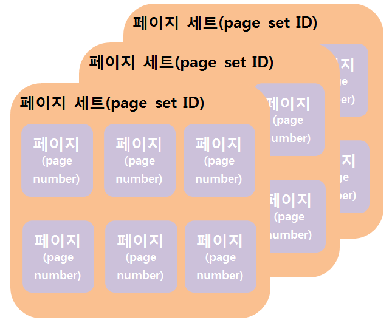

#데이터베이스의 접근

1. DBMS는 사용자가 요구하는 레코드가 어떤 저장 레코드(stored record)인가를 결정해서 파일 관리자에게 그 저장 레코드의 검색을 요청한다. 
2. 파일 관리자는 DBMS가 원하는 저장 레코드가 어떤 페이지에 저장되어 있는가를 결정해서 디스크 관리자에게 그 페이지를 요청한다. 여기서 이 페이지는 블록(block)으로서 입출력읜 단위가 된다. 즉, 디스크와 메인 메모리 사이에 한 번의 디스크 접근으로 데이터가 전송되는 양을 말한다. 통산 1KB, 2KB 또는 4KB 크기의 페이지가 보통이다. 
3. 마지막으로 디스크 관리자는 파일 관리자가 원하는 페이지(block)의 물리적 위치를 알아내어 그 페이지 전송에 필요한 디스크 입출력 명령을 내린다. 

DBMS는 데이터베이스를 저장 레코드의 집합으로 간주하고 파일 관리자와 인터페이스를 한다. 반면에 파일 관리자는 데이터베이스를 페이지의 집합으로 보고 다시 디스크 관리자와 인터페이스를 한다. 마지막 디스크 관리자는 디스크를 실제 있는 그대로 취급한다. 

###디스크 관리자
디스크 관리자는 운영체제의 한 구성 요소로써 모든 물리적 입출력 연산에 대한 책임을 지고 있다. 따라서 **디스크 관리자는 반드시 물리적 디스크 주소에 대해 알고 있어야 한다.**
그러나 디스크 관리자에 명령하는 파일 관리자 자신은 그 페이지의 물리적 위치에 대해서 몰라도 된다. 왜냐하면 이 **파일 관리자는 디스크를 단순히 일정한 크기의 페이지로 구성된 페이지 세트들의 논리적 집합으로 취급하기 때문**이다.  

이 페이지 세트는 유일한 페이지 세트 ID로 식별되고, 이 페이지 세트를 구성하고 있는 각 페이지는 그 디스크 내에서 유일한 페이지 번호로 식별된다. 물론 이 페이지 세트들은 서로 중첩되지 않는다. 즉, 각 페이지는 오직 하나의 페이지 세트에만 속해있고 페이지 세트들에 의해 공용되지 않는다. 디스크 관리자는 바로 이 페이지 번호를 물리적 디스크 주소로 변환하는 사상(mapping)을 수행한다.

이런 방식은 장치에 연관된 특정 코드를 이 디스크 관리자에게만 국한시켜서 상위 레벨의 모든 구성요소들, 특별히 파일 관리자를 물리적 저장 장치로부터 독립시킬 수 있다는 이점이 있다. 

###파일 관리자
파일 관리자는 디스크 관리자를 이용해서 DBMS가 디스크에 저장된 저장 데이터베이스를 저장 파일(stored file)들의 집합으로 취급할 수 있도록 지원한다. 여기서 하나의 저장 파일은 한 레코드 타입의 저장 레코드 어커런스들의 집합을 말한다. 한가지 유의할 것은 DBMS는 페이지 세트에 대한 세부적인 관리 책임은 지지 않지만 페이지 세트의 존재에 대해서는 알고 있어야 한다. 

특별히 DBMS는 어떤 두 저장 파일이 같은 페이지 세트에 저장되어 있는지 또는 어떤 두 저장 레코드가 같은 페이지에 저장되어 있는지를 알아야 한다. 왜냐하면 서로 연관된 레코드는 보통 함께 접근되기 때문에 이들이 같은 페이지에 저장되어 있으면 접근의 효율성을 얻을 수 있기 때문이다. 

페이지 관리가 실제로 어떻게 수행되는지 간단한 대학 테이버베이스를 예로 살펴보자.
학생 테이블

| 학번 | 이름 | 학년 | 학과 |
| -- | -- | -- | -- |
| 100 | 나수영 | 4 | 컴퓨터 |
| 200 | 이찬수 | 3 | 전기 |
| 300 | 정기태 | 1 | 컴퓨터 |
| 400 | 송병길 | 4 | 컴퓨터 |
| 500 | 박종화 | 2 | 산공 |

과목 테이블

| 과목번호 | 과목이름 | 학점 | 담당교수 |
| -- | -- | -- | -- |
| C123 | 프로그래밍 | 3 | 김성국 |
| C312 | 자료구조 | 3 | 황수관 |
| C324 | 파일구조 | 3 | 이규찬 |
| C413 | DB | 3 | 이일로 |
| E412 | 반도체 | 3 | 홍봉진 |

등록

| 학번 | 과목번호 | 성적 |
| -- | -- | -- |
| 100 | 1:2 | A |
| 100 | 1:3 | A |
| 200 | 1:4 | B |
| 300 | 1:5 | A |
| 300 | 1:6 | C |
| 300 | 1:7 | A |
| 400 | 1:8 | A |
| 400 | 1:9 | A |
| 400 | 1:10 | B |
| 400 | 1:11 | C |
| 500 | 1:12 | B |

