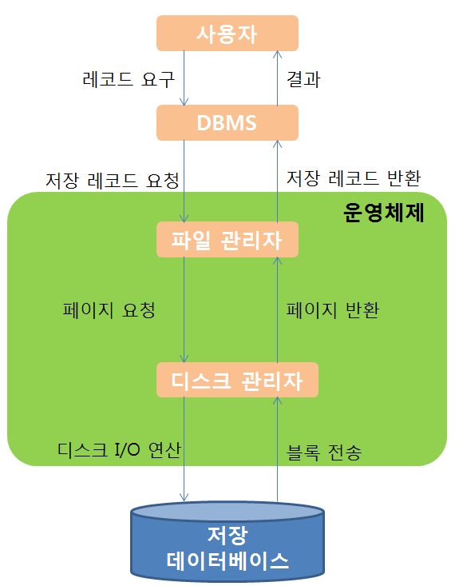
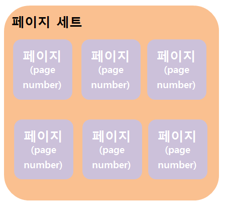

#데이터베이스의 접근

1. DBMS는 사용자가 요구하는 레코드가 어떤 저장 레코드(stored record)인가를 결정해서 파일 관리자에게 그 저장 레코드의 검색을 요청한다. 
2. 파일 관리자는 DBMS가 원하는 저장 레코드가 어떤 페이지에 저장되어 있는가를 결정해서 디스크 관리자에게 그 페이지를 요청한다. 여기서 이 페이지는 블록(block)으로서 입출력읜 단위가 된다. 즉, 디스크와 메인 메모리 사이에 한 번의 디스크 접근으로 데이터가 전송되는 양을 말한다. 통산 1KB, 2KB 또는 4KB 크기의 페이지가 보통이다. 
3. 마지막으로 디스크 관리자는 파일 관리자가 원하는 페이지(block)의 물리적 위치를 알아내어 그 페이지 전송에 필요한 디스크 입출력 명령을 내린다. 

DBMS는 데이터베이스를 저장 레코드의 집합으로 간주하고 파일 관리자와 인터페이스를 한다. 반면에 파일 관리자는 데이터베이스를 페이지의 집합으로 보고 다시 디스크 관리자와 인터페이스를 한다. 마지막 디스크 관리자는 디스크를 실제 있는 그대로 취급한다. 

###디스크 관리자
디스크 관리자는 운영체제의 한 구성 요소로써 모든 물리적 입출력 연산에 대한 책임을 지고 있다. 따라서 **디스크 관리자는 반드시 물리적 디스크 주소에 대해 알고 있어야 한다.**

