빅데이터로 통하는 NoSQL은 다양한 데이터 구조를 갖는다. 그리고 Key/Value, Column Family, Graph, Document 등 다양한 형태의 데이터베이스로 분류된다. 

가장 기본이 되는 Key/Value Store <br>
Key/Value Store에서 컬럼 개념을 확장하여 생성된 Column Family <br>
문서 저장에 적합한 Document Store <br>
네트워크 구조인 Graph 

RDBMS는 row 별로 데이터가 보관되고 조회된다. 관계형 모델의 모든 기준은 row 단위이다. 

NoSQL에서 가장 기본이 되는 것은 Key/Value Store이다. 

Column Family 모델은 Key/Value 모델의 확장이다.

**RDB 모델 **<br>
데이터를 수평적으로 배열하는 구조

|  | 사번 | 성명 | 성별 | 최종학력 |
| -- | -- | -- | -- | -- |
| row1 | 1001 | 홍,길동 | 남 | 하버드대학교 |
| row2 | 1004 | 김,천사 | 여 | 옥스포드대학교 |

**Column Family 모델**<br>
데이터를 수직적으로 쌓아가는 구조

| row key(사번) | Columns(컬럼명) | Value(값) |
| -- | -- | -- |
| 1001 | 성명 | 홍,길동 |
| 1001 | 성별 | 남 |
| 1001 | 최종학교 | 하버드대학교 |
| 1004 | 성명 | 김,천사 |
| 1004 | 성별 | 여 |
| 1004 | 최종학교 | 옥스포드대학교 |

관계형 모델에서는 새로운 컬럼이 추가될 때는 칼럼을 추가해 테이블 구조를 바꾸어야 하고, 특수한 경우에는 데이터도 새로 적재해야 한다. 즉 기존 데이터의 새로 추가된 컬럼에 업데이트하는 과정이 필요하다. 그러나 Column Family 테이블에서는 구조 변경이 필요 없고 확보된 데이터를 칼럼에 기혼여부로 하여 입력하면 된다.

| row key(사번) | Columns(컬럼명) | Value(값) |
| -- | -- | -- |
| 1001 | 성명 | 홍,길동 |
| 1001 | 성별 | 남 |
| 1001 | 최종학교 | 하버드대학교 |
| 1004 | 성명 | 김,천사 |
| 1004 | 성별 | 여 |
| 1004 | 최종학교 | 옥스포드대학교 |
| 1001| 기혼여부 | 기혼 |
| 1004| 기혼여부 | 미혼 |

Column Family DB의 단점은 편한 대신 타 테이블과의 조인이 안 된다는 점이다. 그래서 NoSQL 데이터베이스에서는 조인이 필요한 데이터는 하나의 테이블에 중복으로 관리해 처리 속도를 향상시킨다. 동일한 데이터들이 여러 테이블에 존재하게 되는데 이것을 관리하는 것이 No
SQL 데이터베이스에서는 가장 어려운 점이고 가장 중요한 특징이다. 


---

대표적으로 사용하는 Key/Value Store는 아마존 DynamoDB 같은 NoSQL이다. 


**DynamoDB를 시작하려면** 
1. 테이블의 Key 와 Index 를 결정
2. Read/Write 처리량을 결정

**주로 사용되는 기**능 <br>
Get/Put/Update/Delete/BatchGet <br>
Scan (전체 테이블을 싹쓸이로 긁어옴) <br> 
Query(Hash + 범위 키만) <br>

**테이블 디자인을 위한 요소 (1)**<br>

Table 
* 기본 키로 "Hash key" or "Hash key & Range key"를 선택 <br>

기본 키 : Hash key
* Hash key 단체로 데이터를 고유하게 식별할 수 있는 경우 사용 

기본 키 : Hash key & Range key
* Hash key에 해당하는 여러 데이터에서 Range key로 검색 가능 

Local Secondary Indexes
* Range key 이외에 필터 검색을 위한 키를 가질 수 있음

**테이블 디자인을 위한 요소 (2)**<br>

Attributes
* 데이터의 내용. Hash key에 해당하는 Attributes 이외에는 미리 정의할 필요는 없다. 또한 레코드에서 Attributes가 불규칙하더라도 문제 없다. 

Attributes 형식
* String
* Number
* Binary
* Array of String
* Array of Number
* Array of Binary

**DynamoDB의 데이터 모델**
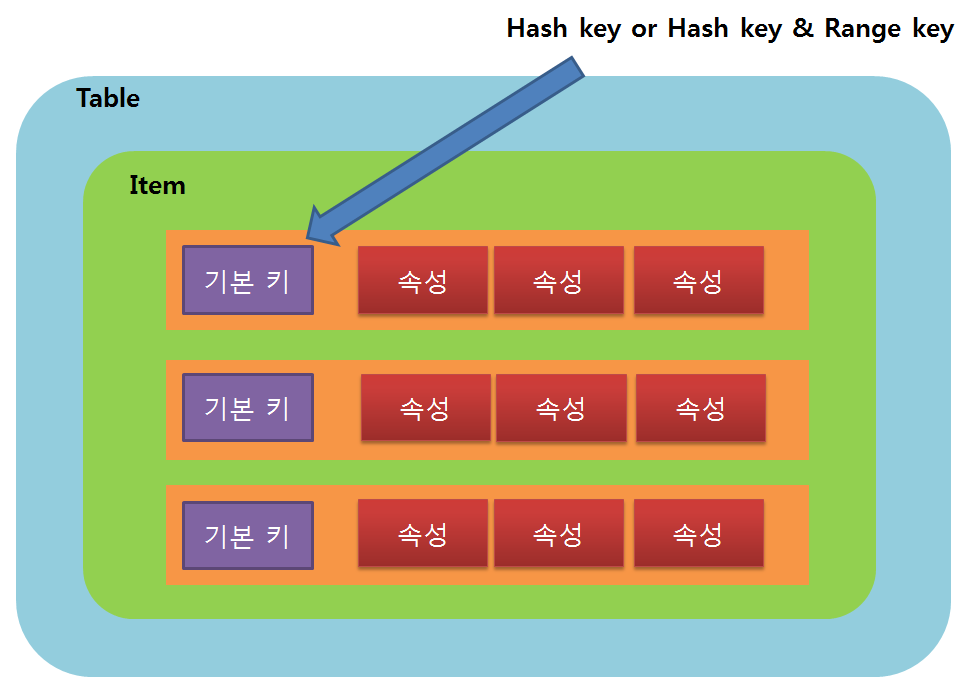

Hash key
* 간단한 키 값
* Hash 이므로 정렬이 필요 없음 

Hash key + Range key
* 복합 기본 키 
* Range key는 sort가 있음 

샘플(1) 상품 카탈로그 <br>

스키마 
* 테이블명 Products
* 상품 ID(ProductId)를 테이블의 Hash key로 사용 


---

#AWS Documentation > AWS Mobile SDK > Android Developer Guide > Amazon DynamoDB

이 섹션은 AWS Mobile SDK(Android)를 사용하여 DynamoDB를 시작하기 위한 가이드를 step-by-step으로 제공한다. <br>
http://docs.aws.amazon.com/mobile/sdkforandroid/developerguide/dynamodb_om.html<br><br>
코드 샘플 <br>
https://github.com/awslabs/aws-sdk-android-samples

AWS-SDK-Android<br>
https://github.com/aws/aws-sdk-android

###Include JAR Files in Your Project (내 프로젝트에 라이브러리 추가하기)

* **gradle 방식** 

    ```
    dependencies {
        compile 'com.amazonaws:aws-android-sdk-core:2.+'
        compile 'com.amazonaws:aws-android-sdk-cognito:2.+'
        compile 'com.amazonaws:aws-android-sdk-s3:2.+'
        compile 'com.amazonaws:aws-android-sdk-ddb:2.+'
    }
    ```
    
    dependencies 풀 리스트

| Dependency | Build.gradle Value |
| -- | -- |
| AWS Mobile SDK core | com.amazonaws:aws-android-sdk-core:2.+ |
| Auto Scaling | com.amazonaws:aws-android-sdk-autoscaling:2.+ |
| Amazon Cloud Watch | com.amazonaws:aws-android-sdk-cloudwatch:2.+ |
| Amazon Cognito Sync | com.amazonaws:aws-android-sdk-cognito:2.+ |
| Amazon DynamoDB | com.amazonaws:aws-android-sdk-ddb:2.+ |
| Amazon DynamoDB Object Mapper | com.amazonaws:aws-android-sdk-ddb-mapper:2.+ |
| Amazon EC2 | com.amazonaws:aws-android-sdk-ec2:2.+ |
| Elastic Load Balancing | com.amazonaws:aws-android-sdk-elb:2.+ |
| Amazon Kinesis | com.amazonaws:aws-android-sdk-kinesis:2.+ |
| Amazon Machine Learning | com.amazonaws:aws-android-sdk-machinelearning:2.+ |
| Amazon Mobile Analytics | com.amazonaws:aws-android-sdk-mobileanalytics:2.+ |
| Amazon S3 | com.amazonaws:aws-android-sdk-s3:2.+ |
| Amazon Simple DB | com.amazonaws:aws-android-sdk-sdb:2.+ |
| Amazon SES | com.amazonaws:aws-android-sdk-ses:2.+ |
| Amazon SNS | com.amazonaws:aws-android-sdk-sns:2.+ |
| Amazon SQS | com.amazonaws:aws-android-sdk-sqs:2.+ |

<br>
* **Maven 방식**
    ```
    <dependencies>
        <dependency>
            <groupid>com.amazonaws</groupid>
            <artifactid>aws-android-sdk-core</artifactid>
            <version>[2.2.0, 2.3)</version>
        </dependency>
        <dependency>
            <groupid>com.amazonaws</groupid>
            <artifactid>aws-android-sdk-cognito</artifactid>
            <version>[2.2.0, 2.3)</version>
        </dependency>
        <dependency>
            <groupid>com.amazonaws</groupid>
            <artifactid>aws-android-sdk-mobileanalytics</artifactid>
            <version>[2.2.0, 2.3)</version>
        </dependency>
    </dependencies>
    ```
Release버전은 여기서 확인 <br>
https://aws.amazon.com/releasenotes/Android

| Service/Feature | artifactID |
| -- | -- |
| AWS Mobile SDK Core [1] | aws-android-sdk-core |
| Auto Scaling | aws-android-sdk-autoscaling |
| Amazon Cloud Watch | aws-android-sdk-cloudwatch |
| Amazon Cognito Sync | aws-android-sdk-cognito |
| Amazon DynamoDB | aws-android-sdk-ddb |
| Amazon DynamoDB Object Mapper | aws-android-sdk-ddb-mapper |
| Amazon EC2 | aws-android-sdk-ec2 |
| Elastic Load Balancing | aws-android-sdk-elb |
| Amazon Kinesis | aws-android-sdk-kinesis |
| Amazon Machine Learning | aws-android-sdk-machinelearning |
| Amazon Mobile Analytics | aws-android-sdk-mobileanalytics |
| Amazon S3 | aws-android-sdk-s3 |
| Amazon Simple DB | aws-android-sdk-sdb |
| Amazon SES | aws-android-sdk-ses |
| Amazon SNS | aws-android-sdk-sns |
| Amazon SQS | aws-android-sdk-sqs |

<br>
* **jar파일 직접넣기** 
	
http://docs.aws.amazon.com/mobile/sdkforandroid/developerguide/Welcome.html<br>

여기서 **Download the AWS Mobile SDK for Android**부분에서 

'Download AWS Mobile SDK for Android (zip file)' 클릭하면 소스 전체를 다운받을 수 있는데

압축풀고 lib 폴더안에 jar파일들이 있다. (github에서 다운받아지는 거랑 다름)

이클립스를 사용중이라면 jar파일들을 내 프로젝트의 libs 폴더에 넣고, 안드로이드 스튜디오를 사용중이라면 apps/libs 폴더에 넣는다. 그러면 자동으로 빌드 패스에 포함시킬것이다.


### Add Import Statements 
내 메인 액티비티에 해당 클래스들을 import한다 
```
import com.amazonaws.auth.CognitoCachingCredentialsProvider;
import com.amazonaws.regions.Regions;
import com.amazonaws.services.dynamodbv2.*;
import com.amazonaws.mobileconnectors.dynamodbv2.dynamodbmapper.*;
import com.amazonaws.services.dynamodbv2.model.*;
```

### Set Permissions in Your Android Manifest
```
<uses-permission android:name="android.permission.INTERNET" />
```

### Create an Identity Pool
내 모바일 애플리케이션에 AWS Services를 사용하기 위해서는 내 credential provider로 Amazon Cognito Identity를 이용해서 AWS Credentials를 얻어야 한다. credentials provider를 사용하는 것은 내가 애플리케이션에서 pivate credentials를 내장하는거 없이 AWS Services에 접근을 허용한다. 이것은 또한 내 애플리케이션 사용자가 어떤 AWS Services를 접근하는지에 대한 권한을 통제 할수 있다. 

내 애플리케이션 사용자들의 identities는 identity pool에 의해 내 계정에 저장되고 관리된다. 모든 identity pool은 사용자가 접근할 수 있는 AWS resources를 지정하는 역할을 갖는다. 일반적으로 개발자는 한 애플리케이션에 한 identity pool을 사용한다. 

내 애플리케이션에 identity pool을 생성하기 위해서는 
1. https://console.aws.amazon.com/cognito/home 에 로그인해서 접속한다.
2. 'Create new identity pool' 버튼을 클릭한다.
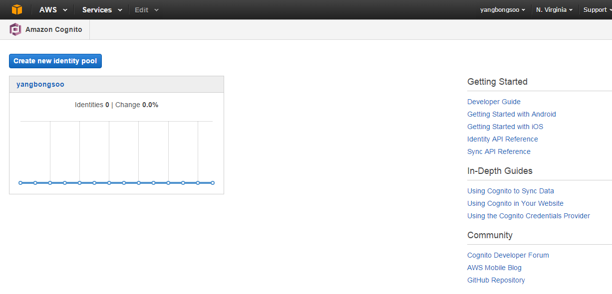
3. 'Identity pool name' 적고 'Unauthenticated identities'의 enable access to unauthenticated identities 체크박스를 체크하고 Create Pool 클릭한다. 
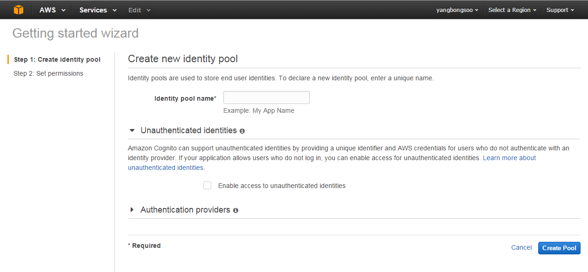
4. Allow 누른다
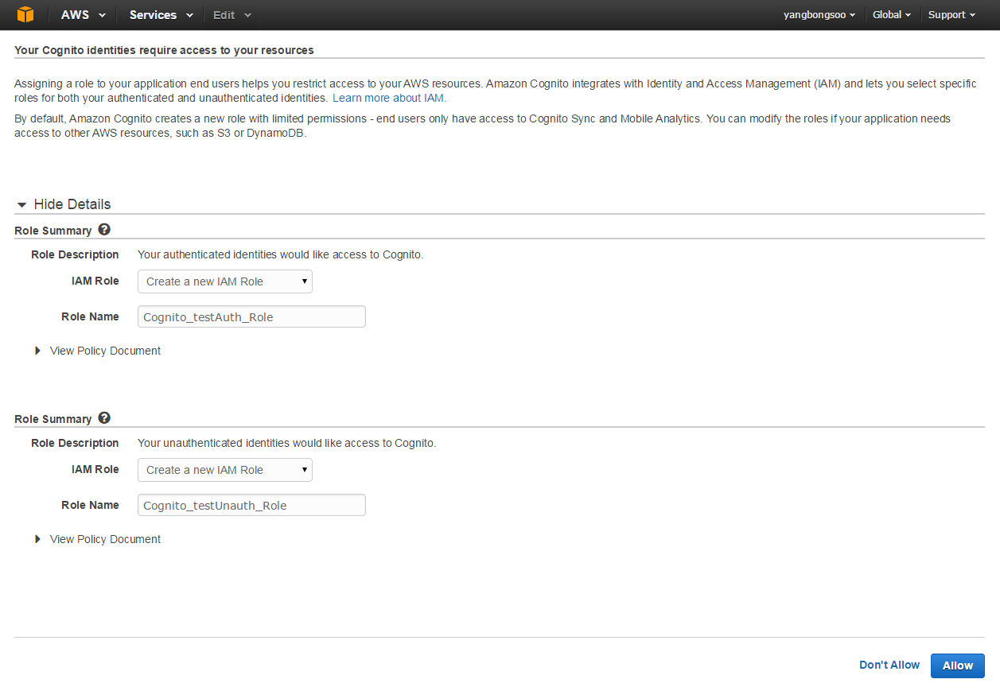

다음페이지는 credentials provider를 생성하는 코드를 보여준다. 그래서 너가 쉽게 안드로이드 애플리케이션에서 Cognito Identity를 통합 할 수 있다.
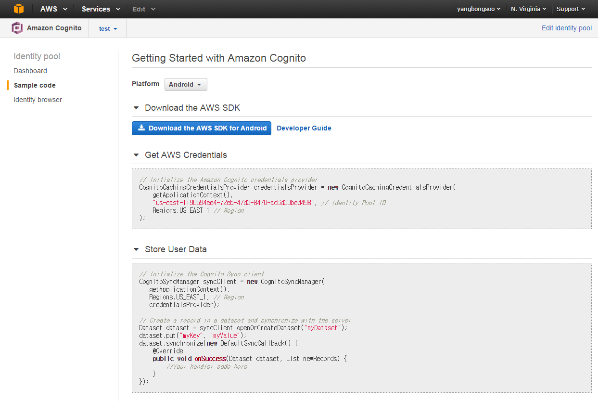


###Create DynamoDB Table
이 튜토리얼을 위해 우리가 서점 앱을 만든다고 가정하자. Books table을 만들기 위해 </br>
1. https://console.aws.amazon.com/dynamodb/home 접속한다. (서버 지역 확인) 
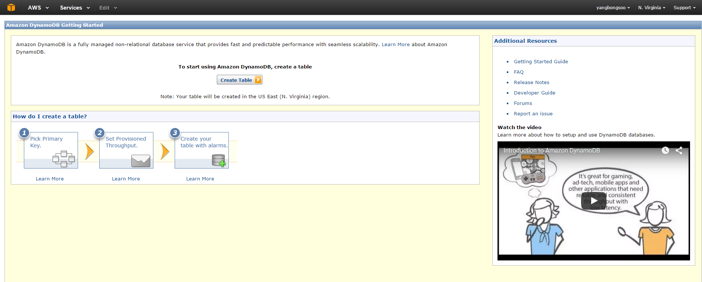
2. Create Table을 클릭한다.
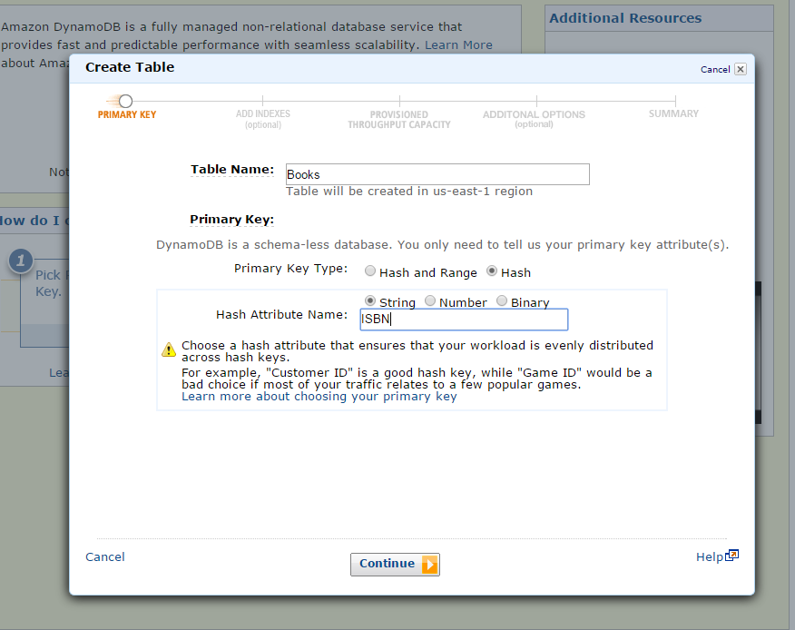
3. Table Name에 Books를 적는다.
4. Primary key type으로 Hash를 선택한다.
5. Hash Attribute Name에 ISBN적고 type은 String으로 한다. 그리고 continue 클릭
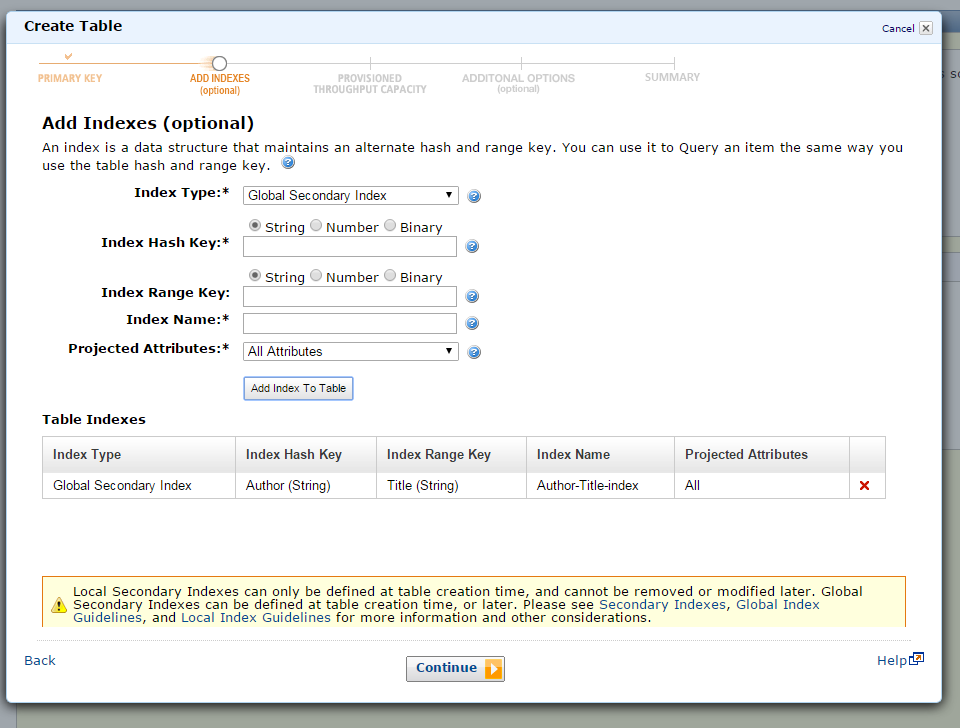
6. 인덱스는 hash와 range key 대체를 위한 데이터 구조이다. Index type을 Global Secondary Index로 한다. Index Hash Key의 type을 String으로 하고 Author를 적어 넣는다.
7. Index Range key type을 String으로 하고 Title을 적어 넣는다.
8. 나머지 것들은 default로 남기고 Add Index to Table 클릭하고 Continue한다.
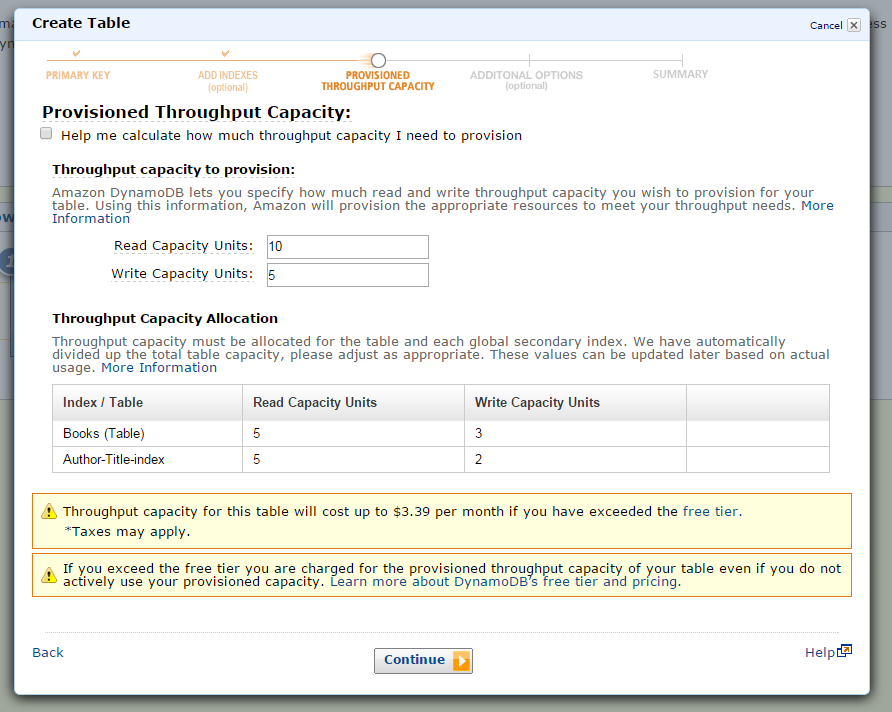
9. Read capacity를 10으로 Write capacity를 5로 하고 continue한다.
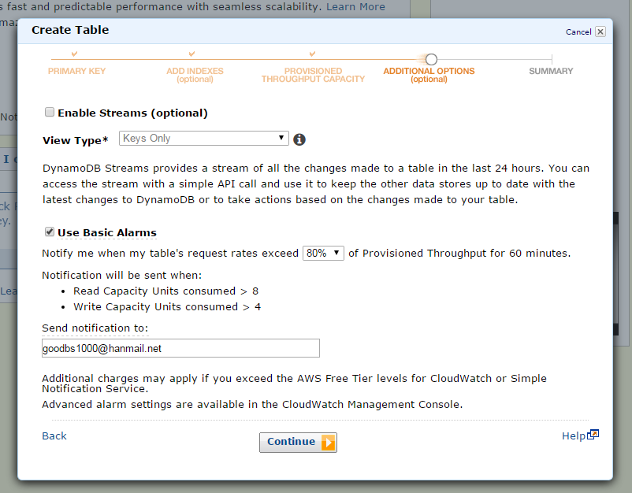
10. 노티 알려줄 이메일주소 적고 continue한다. 
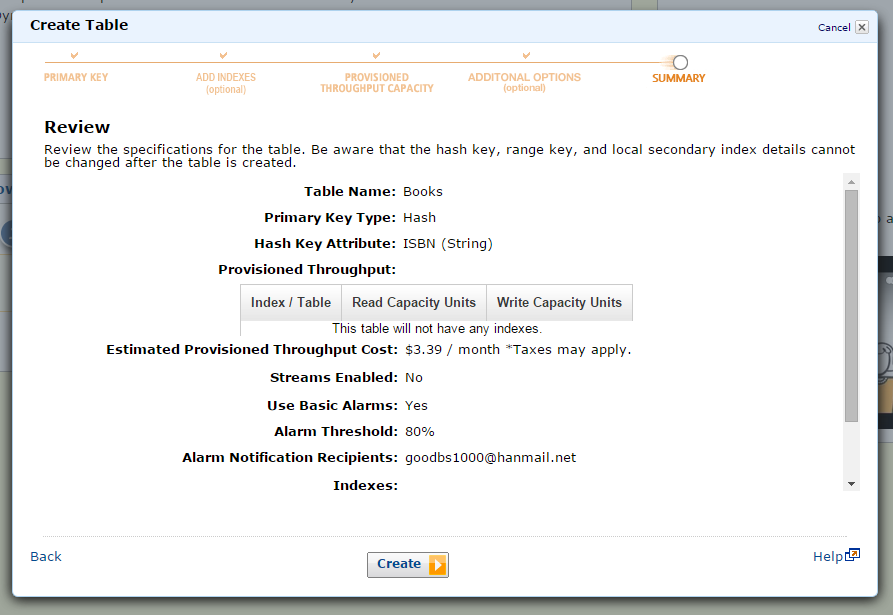
11. Create 클릭하면 DynamoDB가 만들어 진다. 
12. Details 탭 눌러보면 ARN 복사해라 곧 쓸거다 
 
### Set Permissions
애플리케이션에서 DynamoDD를 사용하기 위해서 올바른 권한을 설정해야한다. 
```
{
"Statement": [{
    "Effect": "Allow",
    "Action": [
        "dynamodb:DeleteItem",
        "dynamodb:GetItem",
        "dynamodb:PutItem",
        "dynamodb:Scan",
        "dynamodb:Query",
        "dynamodb:UpdateItem",
        "dynamodb:BatchWriteItem"
    ],
    "Resource": [
        "arn:aws:dynamodb:us-west-2:123456789012:table/Books",
        "arn:aws:dynamodb:us-west-2:123456789012:table/Books/index/*"
    ]
}]
}
```
다음의 IAM policy는 유저가 ARN으로 두개의 resources(테이블과 인덱스) 작업을 수행할 수 있게 한다.

내 Cognito identity pool의 unauthenticated role에 이 policy를 적용해서 내 DynamoDB table에 대한 올바른 ARN과 Resource 값을 대체해라.

1. IAM Console에 로그인 **https://console.aws.amazon.com/iam/home#home**
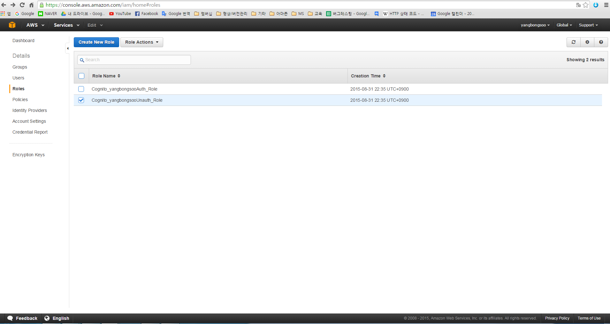
2. Roles를 선택하고 Cognito가 만들어준 Unauth를 선택해라 
3. Attach Role Policy를 클릭해라(Create Role Policy를 말하는거 같다)
4. Custom Policy를 선택하고 클릭 
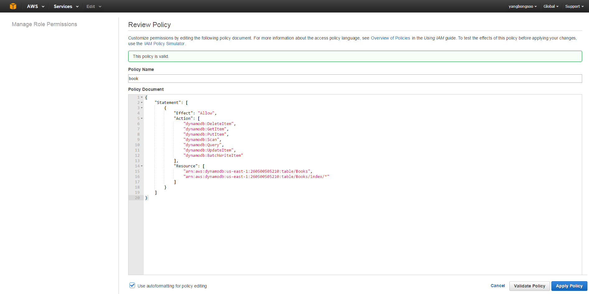
5. policy 이름을 적고 위에 있는 policy를 policy document에 붙여넣어라(ARN, Resource value 바꿔서)
6. Apply Policy 클릭

### Create a DynamoDB Client and Object Mapper

이제 DB와 client-side class를 맵핑할 DynamoDB Object Mapper를 사용하자. Object Mapper를 사용하기 위해 첫번째로 DynamoDB client를 인스턴스화 해야한다. 

우리가 identity pool을 만들때, Cognito client initialization code를 우리 앱에 복사했었다. 

```
AmazonDynamoDBClient ddbClient = new AmazonDynamoDBClient(credentialsProvider);
```
credentialsProvider 변수는 Cognito Sample code에 선언되어 있다 복사붙여넣기 하자 
그리고 Object Mapper를 생성하기 위해 DynamoDB client를 사용할 수 있다.
```
DynamoDBMapper mapper = new DynamoDBMapper(ddbClient);
```

이제 DB에 클래스를 매핑할 준비가 됐다  .

###Define a Mapping Class 

DynamoDB에서 database는 테이블들의 집합이다. 한 테이블은 다음과 같이 설명될 수 있다. 
1. 한 테이블은 아이템들의 집합이다.
2. 각각의 아이템은 속성들의 집합이다.
3. 각각의 속성은 name과 value를 갖는다. 

bookstore 앱에서, 테이블안의 각각의 아이템은 book을 대표 할 것이고 각각의 아이템은 5가지 속성들을 갖는다. Title, Author, Price, ISBN, Hardcover

자바코드에서 Book 객체를 Book 테이블의 각각의 item에 맵핑하기 위해서, 자바코드의 객체 표현을 통해서 다이렉트로 database item을 조작할 수 있다  

맵핑하기 위해 DynamoDB는 annotations을 정의한다. 
1. @DynamoDBTable - DynamoDB의 타켓 테이블을 식별한다.
2. @DynamoDBHashKey - 테이블의 해쉬속성에 클래스 속성을 맵핑한다.
3. @DynamoDBAttribute - 아이템 속성에 클래스 속성을 맵핑한다. 

DynamoDB annotation 전체 리스트 http://docs.aws.amazon.com/ko_kr/amazondynamodb/latest/developerguide/JavaDeclarativeTagsList.html

이제 Book 맵핑 클래스를 만들자
```
import com.amazonaws.mobileconnectors.dynamodbv2.dynamodbmapper.*;

@DynamoDBTable(tableName = "Books")
public class Book {
    private String title;
    private String author;
    private int price;
    private String isbn;
    private Boolean hardCover;

    @DynamoDBIndexRangeKey(attributeName = "Title")
    public String getTitle() {
        return title;
    }

    public void setTitle(String title) {
        this.title = title;
    }

    @DynamoDBIndexHashKey(attributeName = "Author")
    public String getAuthor() {
        return author;
    }

    public void setAuthor(String author) {
        this.author = author;
    }

    @DynamoDBAttribute(attributeName = "Price")
    public int getPrice() {
        return price;
    }

    public void setPrice(int price) {
        this.price = price;
    }

    @DynamoDBHashKey(attributeName = "ISBN")
    public String getIsbn() {
        return isbn;
    }

    public void setIsbn(String isbn) {
        this.isbn = isbn;
    }

    @DynamoDBAttribute(attributeName = "Hardcover")
    public Boolean getHardCover() {
        return hardCover;
    }

    public void setHardCover(Boolean hardCover) {
        this.hardCover = hardCover;
    }
}
```
hardCover가 nullable 타입인것을 주목해라. DynamoDB Object Mapper에서 primitives와 nullable 타입은 다게 동작한다. save()에서 unset nullable 타입은 DynamoDB에 보내지지 않고, unset primitive는 default 값으로 보내진다. 

###Interact with Stored Objects 

현재, database가 있고, mapping class가 있고, Object Mapper Client가 있다. 이제 클라우드에서 객체들을 interacting할 수 있다. 

**Save an Item**<br>
객체를 저장하기 위해서, 먼저 생성하고, 적절한 필드값을 세팅시킨다.
```
Book book = new Book();
book.setTitle("Great Expectations");
book.setAuthor("Charles Dickens");
book.setPrice(1299);
book.setIsbn("1234567890");
book.setHardCover(false);
```
그리고 테이블에서 클래스 객체와 상응하는 item에 write하기 위해 Object Mapper client를 사용한다. <br>
클라이언트에서 save() 메소드를 콜함으로써 book객체를 보낸다.
```
mapper.save(book);
```
기본 키(여기서 "ISBN")를 제외하고 테이블에서 item들의 스키마가 미리 정의되어 있는건 없다. 매핑 클래스를 업데이트하고 추가하거나 뜻에 속성을 제거할 수 있다. item이 가질 수 있는 속성 수는 400KB size 이하로 가질 수 있다. 

**Retrieve an Item(검색)**

object의 기본 키(여기서 해쉬 속성인 "ISBN")를 이용해서 DB로부터 상응하는 item을 로드할수 있다. 다음의 코드는 "1234567890"의 ISBN으로 도서 항목을 반환한다.
```
Book selectedBook = mapper.load(Book.class, "1234567890");
```

**Update an Item**

DB의 item을 업데이트 하기 위해서 새로운 속성을 세팅하고 object를 저장하기만 하면 된다. 예를 들어 다음과 같이 price를 업데이트 할 수 있다.
```
Book selectedBook = mapper.load(Book.class, "1234567890");
selectedBook.setPrice(1199);
mapper.save(selectedBook);
```

새로운 해쉬 키는 DB에새로운 item을 생성한다는 것을 주목해라 비록 클라이언트쪽에서 새로운 object를 생성하지 않음에도 불구하고. 다음의 예를 보자.
```
Book selectedBook = mapper.load(Book.class, "1234567890");
selectedBook.setIsbn("0987654321");
mapper.save(selectedBook);
```
결과는 DB에 loaded된 item과 동일하지만, 새로운 ISBN을 갖는 새로운 item이다. 
이제 selectBook은 새로운 DB의 새로운 item을 맵핑하지만 이전의 item도 남아있다. 

**Delete an Item**<br>
DB의 item을 지우기 위해 delete()메소드를 사용한다. 
```
mapper.delete(selectedBook);
```

###Perform a Scan
스캔 작업으로, 주어진 테이블에서 모든 item들을 검색할 수 있다. 스캔은 table의 모든 item을 검사하고 비순차적으로 결과를 리턴한다. 
```
DynamoDBScanExpression scanExpression = new DynamoDBScanExpression();
PaginatedScanList<Book> result = mapper.scan(Book.class, scanExpression);
// Do something with result.
```
리턴된 item들의 리스트는 가능한 느리게 로드된다. 그러므로 DynamoDB를 콜하는것은 필요에따라 만들어진다. 미리 전체 dataset을 다운로드할 필요가 있을 때, 전체 리스트를 가져오기 위해 size() 메소드를 콜할 수 있다. 

Object Mapper에 의해 리턴된 리스트는 수정될수 없고 그렇게 시도했을 때 결과는 exception뜬다. 
만약 수정할 수 있는 user interface component(예를들어 수정가능한 ListActivity)를 위해 데이터소스로 스캔의 결과를 사용하길 원한다면, 수정할 수 있는(modifiable) list object 를 생성하고 거기에 data를 옮긴다. 

스캔은 비용이 많이 드는 작업이며 테이블에 우선 순위가 높은 트래픽을 방해하지 않도록주의해서 사용해야 한다. The Amazon DynamoDB Developer Guide는 http://docs.aws.amazon.com/ko_kr/amazondynamodb/latest/developerguide/Introduction.html dp scan 작업의 최고 실행을 설명한다. 

###Perform a Query
쿼리 작업은 hash와 range key 속성을 이용해 테이블의 아이템을 찾는다. Books테이블의 기본키는 range key를 갖지 않는다. 그러나 테이블을 만들때 global secondary index를 명시하고 그건 range key 속성을 갖는다.<br> 우리는 hash키와 secondary index의 범위 키에 대해 쿼리를 수행할것이다.

**Secondary Indexes**<br>
