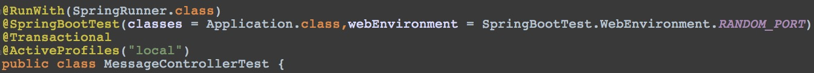

# JUnit+Mockito vs groovy+spock

발표 순서<br>
다루지 않을 부분 : Test가 뭔가, Mockito가 뭔가, Unit Test, Integration Test가 뭔가

1. Spring Boot 1.4 Test방식 변경부분 소개 
2. 내가 만든 Java+Mockito 단위 테스트와 groovy-spock으로 만든 단위 테스트 비교분석  

참고1 : http://d2.naver.com/helloworld/568425<br>
참고2 : http://groovy-coder.com/?p=111<br>
참고3 : http://kingori.egloos.com/4169398

**Mock Object**<br>
Mock Object 는 검사하고자 하는 코드와 맞물려 동작하는 객체들을 대신하여 동작하기 위해 만들어진 객체이다. 검사하고자 하는 코드는 Mock Object 의 메서드를 부를 수 있고, 이 때 Mock Object는 미리 정의된 결과 값을 전달한다. MockObject는 자신에게 전달된 인자를 검사할 수 있으며, 이를 테스트 코드로 전달할 수도 있다.

**stub**<br>
Stub 은 테스트 과정에서 일어나는 호출에 대해 지정된 답변을 제공하고, 그 밖의 테스트를 위해 별도로 프로그래밍 되지 않은 질의에 대해서는 대게 아무런 대응을 하지 않는다. 또한 Stub은 email gateway stub 이 '보낸' 메시지를 기억하거나, '보낸' 메일 개수를 저장하는 것과 같이, 호출된 내용에 대한 정보를 기록할 수 있다. <br>
Mock은 Mock 객체가 수신할 것으로 예상되는 호출들을 예측하여 미리 프로그래밍한 객체이다. 

**example**<br>
```
1. Behavior verify

//Let's import Mockito statically so that the code looks clearer
import static org.mockito.Mockito.*;

//mock creation
List mockedList = mock(List.class);

//using mock object
mockedList.add("one");
mockedList.clear();

//verification
verify(mockedList).add("one");
verify(mockedList).clear();

2. Stubbing

//You can mock concrete classes, not only interfaces
LinkedList mockedList = mock(LinkedList.class);

//stubbing
when(mockedList.get(0)).thenReturn("first");
when(mockedList.get(1)).thenThrow(new RuntimeException());

//following prints "first"
System.out.println(mockedList.get(0));

//following throws runtime exception
System.out.println(mockedList.get(1));

//following prints "null" because get(999) was not stubbed
System.out.println(mockedList.get(999));

//Although it is possible to verify a stubbed invocation, usually it's just redundant
//If your code cares what get(0) returns then something else breaks (often before even verify() gets executed).
//If your code doesn't care what get(0) returns then it should not be stubbed. Not convinced? See here.
verify(mockedList).get(0);
```

**Spring Boot 1.4 Testing Improvements**<br>
참고 : https://spring.io/blog/2016/04/15/testing-improvements-in-spring-boot-1-4<br>

before


after


