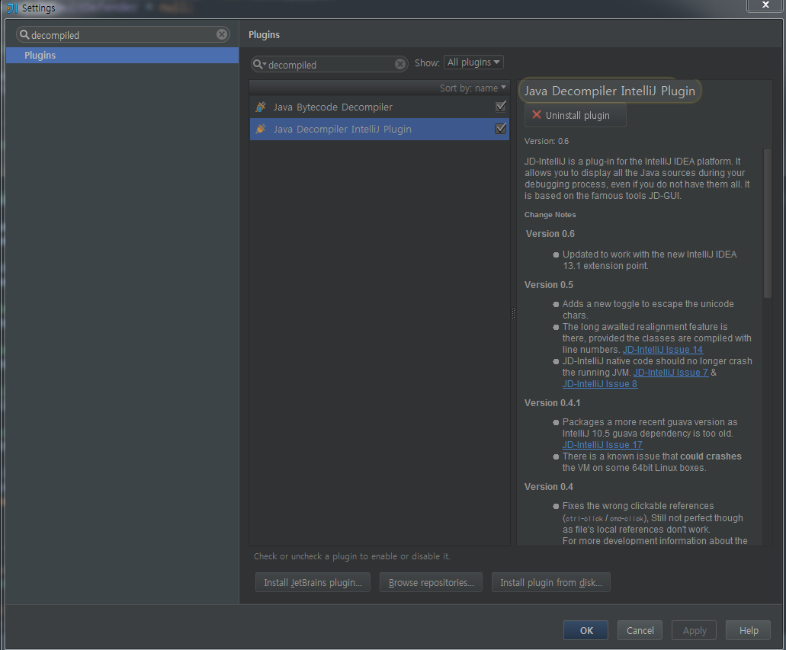
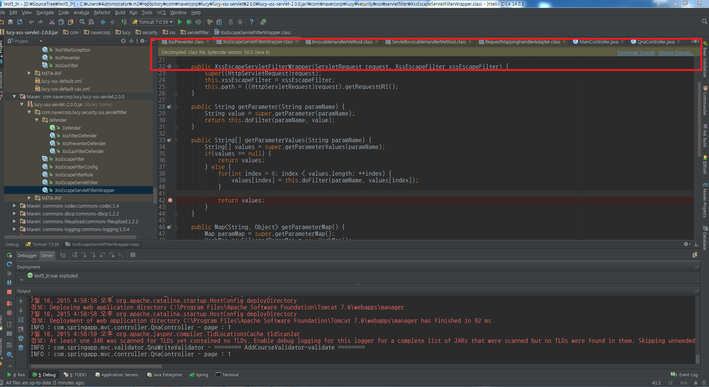
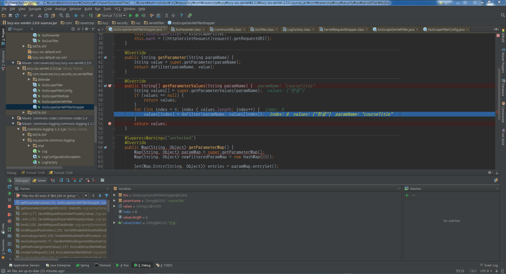

IntelliJ에서 External Libraries에 있는 외부 클래스 파일 디버깅 방법에 대해서 

먼저 Java Decompiler plugin을 다운받는다 

그리고  Decompiled .class file ... 여기서 Download Source를 누른다.  

이제 디버깅을 할 수 있게 된다.  

그런데 External Libraries에 있는 모든 클래스 파일을 java파일로 디컴파일 가능할 줄 알았는데 그건 또 아니다. 어떤건 눌러도 변환되지 않는다. (그 이유 아직 모르겠음)  

그리고 이걸 한 후로부터 디버깅하는거 에 대해 좀 꼬이게 됐다.  

