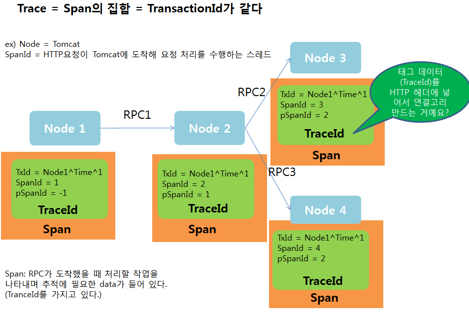
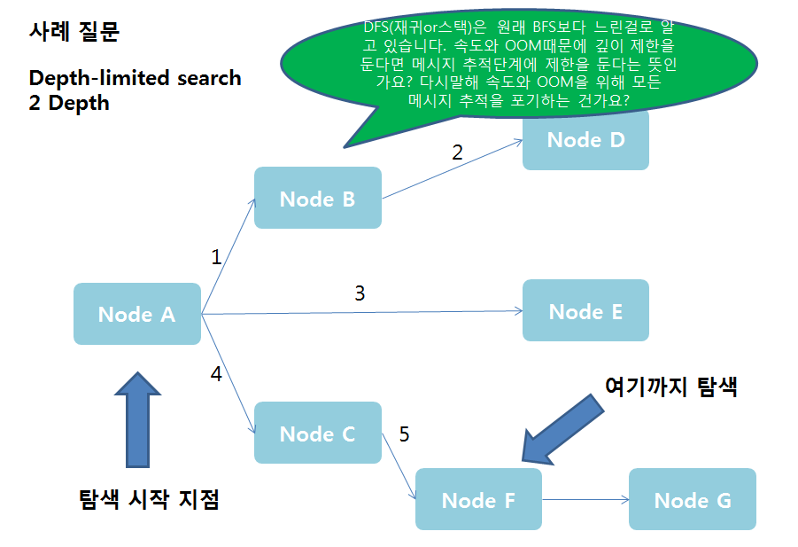
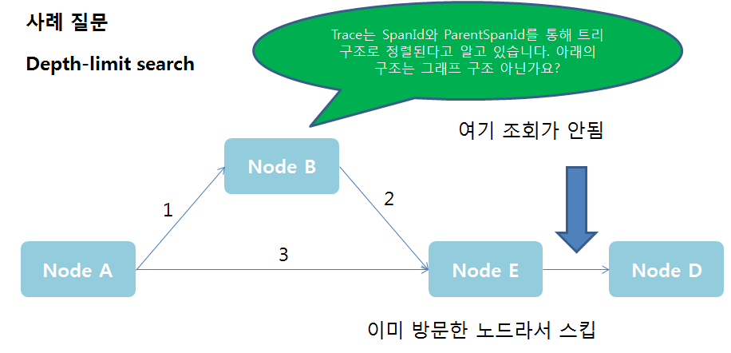
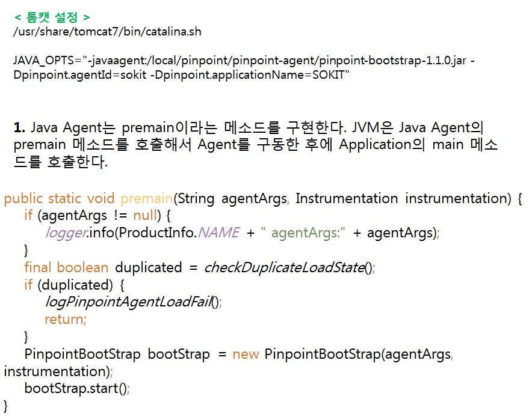
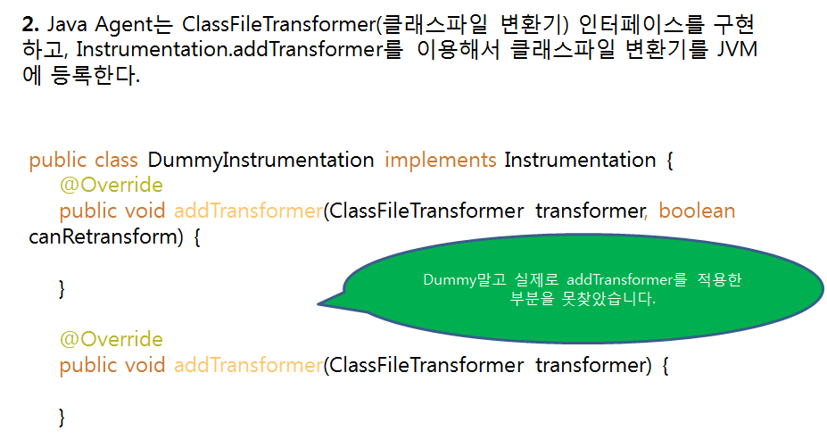
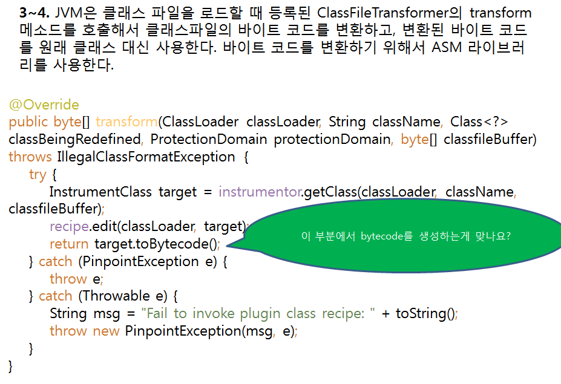
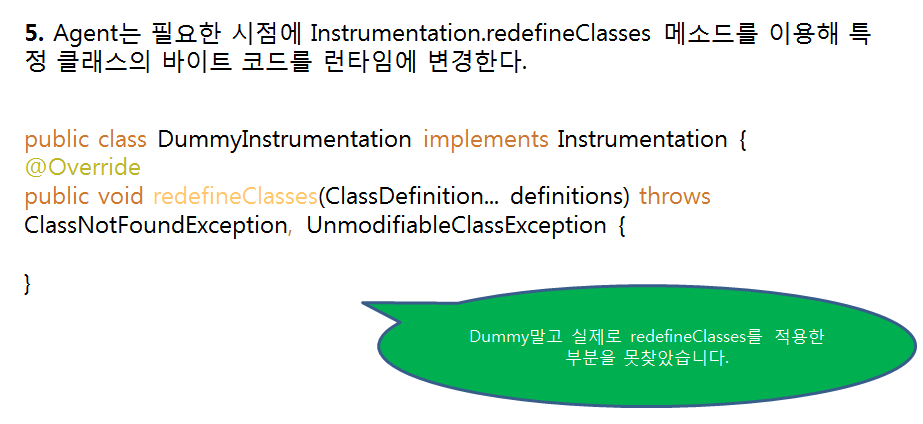
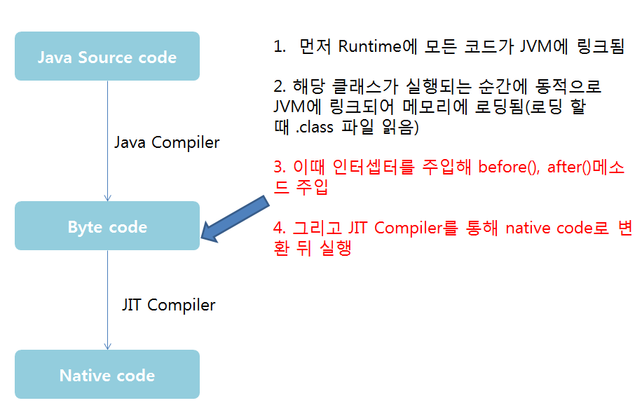

**1. TraceId 작동 사례**  
하나의 Trace는 Span들의 집합이고 각각의 Span은 RPC가 도착할 때 처리할 작업을 나타내며 추적에 필요한 데이터를 가지고 있습니다. 그 데이터는 TraceId인데 TraceId는 TransactionId와 SpanId, ParentId로 이루어진 키의 집합입니다. 

이 TraceId를 HTTP 헤더에 넣어서 전송함으로써 각각의 노드 간의 관계를 정의 할 수 있습니다. 결국 Trace는 사용자의 한 요청에 따라 동작되는 모든 로직을 의미합니다. 그래서 한 Trace에 TransactionId가 같게 하는겁니다. 

**2-1. 사례 질문** 
먼저 DFS와 BFS에 대해 잘못 알고 있는 부분이 있었습니다. 저는 보통 DFS를 재귀로 호출하는 형식으로 알고리즘을 짜서 느리다라고 생각했습니다. 하지만 전체 순회를 한다고 가정하에 DFS를 스택으로 구현한다면 BFS와 거의 똑같다고 합니다. 

즉, DFS, BFS의 속도 차이는 주어진 조건에 따라 다르다는것을 알았습니다.   

두번째로 Pinpoint는 모든 요청을 추적하지 않고 샘플링한 데이터를 수집할 수 있습니다. 적은 양의 데이터만 수집해도 전체 애플리케이션의 상태를 확인하는데 무리가 없기때문에 깊이의 제한을 둬도 문제가 없습니다. 또한 모든 요청을 다 캐치하면 

네트워크 대역폭이 다 차기 때문에 속도가 느려지도 오히려 성능저하가 크게 발생하게 됩니다. 

**2-2. 사례 질문** 
저는 TraceId 작동 사례만 보고 항상 트리구조인줄 알았습니다. 그래프 구조인게 맞는데 TraceId 작동 사례를 예로 들면 노드3번 or 노드4번의 ParentSpanId가 -1이라면 그래프 구조가 되는겁니다. 

결국 구조는 사용자의 아키텍처가 어떻게 되냐에 따라 결정됩니다. 

**3-1. Bytecode Instrument 질문**  

제 톰캣의 catalina.sh에 자바 옵션으로 javaagent를 설정함으로써 JVM이 구동될 때 이 JVM 안에서 특정 작업을 수행할 에이전트(Agent), 즉 요원을 지정할 수 있는 방식을 제공합니다. 

1번부터 5번까지 일련의 과정을 통해서 Agent가 작동하고 3~4번 transform에서 bytecode로 변환하는 부분이 있는데 Pinpoint에서는 직접 bytecode를 생성하기도 하고 라이브러리를 사용하기도 합니다.

추가적으로 저는 3~4번에서 바이트코드를 변환하기 위해서 ASM 라이브러리를 사용하는줄 알았는데, 어제 발표에서 Pinpoint의 새로운 기능으로 ASM기반 으로 해서 프로그래머가 직접 trace할 구간을 정할 수 있도록 한다고 합니다. 

3-2. Bytecode Instrument 질문

아래 그림의 3번에서 해당 클래스가 메모리에 로딩될 때 Agent가 인터셉터로 before(), after()메소드를 주입시킵니다. 그리고 나온 결과를 네트워크 통신(TCP/UDP)을 통해 Collector로 전송시킵니다. 

TCP로는 DB같은 중요한 데이터를 전송하고 나머지는 UDP로 전송합니다.(어제 강의를 통해 들었는데 맞는지 확신이 안섭니다.) 그리고 4번에서 native code로 변환하고 실행이 됩니다. 

**4-1. 추가적인 질문** 
어제 Pinpoint의 발전방향에서 Java가 아닌 구간의 프로파일링으로써 WebServer 구간의 성능 수집을 말씀하셨습니다. 

제가 알고 있는 개념은 아래 그림과 같습니다. 요즘 톰캣이 많이 발전되서 일부 WebServer기능까지 담고 있어서 아래와 같이 표현을 했습니다. 

보통 WebServer는 정적인 데이터를 처리하는 서버이고 WebApplicationServer가 동적인 데이터를 처리하는 서버인데 WebServer 구간의 성능 수집이라 하시면 정적 데이터가 로딩되고 렌더링되는 성능 수집을 말씀하시는건가요?

또 톰캣을 통해 성능 수집을 하는 것을 Java구간의 프로파일링이라고 하는 건가요?

**4-2. 추가적인 질문**

Pinpoint의 동작 원리, 구조를 실제 코드를 통해 보려고 소스다운을 하고 열어보면서 공부는 하고 있지만 저 로직 흐름을 완전히 알지 못하기에 어디서부터 시작해야될지 사실 막막합니다. 

어제 Plugin을 말씀해주셨는데 구체적으로 어디의 plugin인가요? 다 찾아봤는데 마땅한 시작점을 발견하지 못했습니다. 