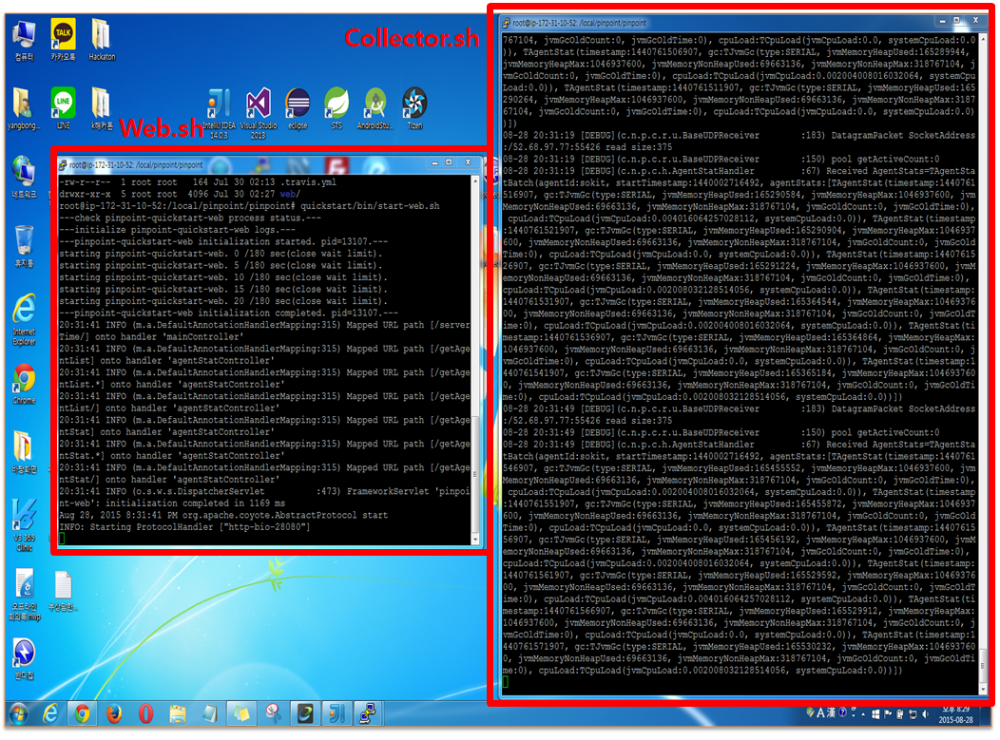
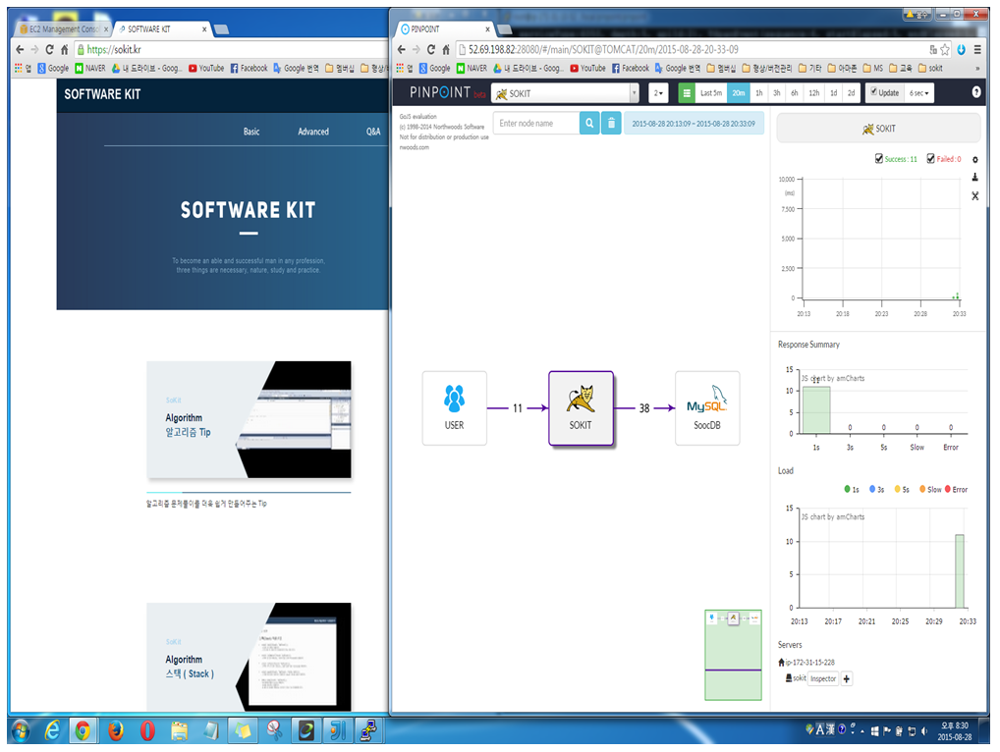
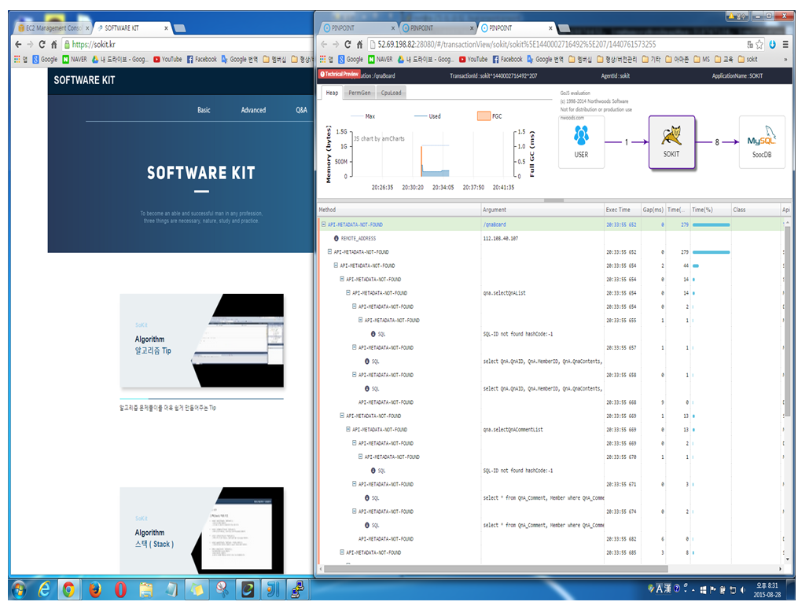

허광남님 동영상 url:https://www.youtube.com/watch?v=xipAXrm4vEI

jdk1.6, 1.7다운은 oracle가서 다운받는다.(이전버전은 로그인해야 다운가능) 

url 복사해서 ```curl url붙여넣기 -o jdk버전``` 써놓으면 된다.

jdk1.7은 ```tar xvfz jdk1.7~~``` 로 압축푼다.

jdk1.6은 bin을 다운받았기 때문에 ```chmod +x jdk1.6.bin``` 해서 ll 해서 보면 녹색으로 바뀐다.<br> 그리고 ``` ./jdk1.6.bin ```하면 실행이 되면서 압축이 풀린다.

병수가 이전에 설치해놓은 jdk1.7 위치는 ```/usr/lib/jvm/jdk1.7.0 ```(openJDK라 환경변수설정을 따로 안했다고 함) 

환경변수 설정하기위해 ``` vi ~/.bash_profile ``` 가서 하는데 bash_profile이 왜 없나 했더니 Ubuntu는 bash_profile이 없고 bash.bashrc사용힌다.(동영상은 Centos) 

``` /etc/bash.bashrc ```가보니 맨끝에 export JAVA_HOME=/usr/lib/jvm/java-7-openjdk-amd64/  이렇게 되어있다. 

export JAVA_HOME=/usr/lib/jvm/java-7-openjdk-amd64/ <br>
export JAVA_7_HOME=/usr/lib/jvm/java-7-openjdk-amd64/<br>
export JAVA_6_HOME=/files/sokit/pinpointInstallDirectory/jdk1.6.0_45<br>

추가적으로 위와 같이 작성한다.

다음은 메이븐을 다운받는다. (3.2버전 이상)
http://maven.apache.org/download.cgi 가서  apache-maven-3.3.3-bin.tar.gz 링크 복사해서 

``` curl url붙여넣기 -o apache-maven-3.3.3.tar.gz ```으로 함 (압축풀기) 

그리고``` ln -s apache-maven-3.3.3 maven ```해서 단축링크로 만듦

그리고 /files/sokit/pinpointInstallDirectory/maven 이 경로를 PATH에다가 추가해줘 

////////////////////////////////////////////////////////////////////////////////////////////////</br>
PATH=$PATH:$JAVA_HOME/bin</br>
PATH=$PATH:/files/sokit/pinpointInstallDirectory/maven/bin</br>
PATH=$PATH:$HOME/bin</br>
</br>
export PATH</br>
////////////////////////////////////////////////////////////////////////////////////////////////</br>

그다음 git을 설치해야함 ``` apt-get install git ```

여기까지가 pinpoint를 설치하기 위한 도구셋팅 !! 

``` git clone https://github.com/naver/pinpoint.git ```명령어 쳐서 다운받고 pinpoint디렉토리에 들어가서 

``` git tag -l ```해보면 릴리즈된 버전들이 있다 

``` git checkout tags/1.1.0 ```해주면 1.1.0버전으로 소스가 쫙 바뀜

다음에 ``` mvn clean install -Dmaven.test.skip=true ```해주면 관련된것들을 빌드함 (필요한 jar파일들 다운받아서 설치해줌) 

이제 pinpoint 빌드는 다 됐고 실행할 준비가 됐음 

``` du -h ```해보면 용량 알수있음 

``` quickstart/bin/start-hbase.sh  ```해서 hbase 다운받음 <br>
``` quickstart/bin/init-hbase.sh  ```DB 테이블을 만들어줌 <br>
``` quickstart/bin/start-collector.sh ```Collector를 띄워 <br>

Collector가 다 띄워지면 새로운 putty창 열어서 Web UI띄움 

``` quickstart/bin/start-web.sh ```(AWS에서 28080 포트 열어주는거 잊지마) 

이게 되면 또하나가 필요한데 test를 할 수 있는 putty창 띄워서
``` quickstart/bin/start-testapp.sh ```한다 

**Agent 붙여서 실제로 돌리기** 

1. 내 웹 서버에서 /usr/share/tomcat7/bin 가서 catalina.sh에 자바옵션을 추가해줘 (윈도우에서는 catalina.bat 고쳐야함)

JAVA_OPTS="-javaagent:/local/pinpoint/pinpoint-agent/pinpoint-bootstrap-1.1.0.jar -Dpinpoint.agentId=sokit -Dpinpoint.applicationName=SOKIT" 

그리고 실제로 /local/pinpoint에다가 pinpoint-agent가 있도록 설정해야함 

/local/pinpoint/pinpoint/agent/target에 있는 pinpoint-agent 디렉토리 자체를 옮겨야함

``` cp -r pinpoint-agent ~/local/pinpoint/ ```로 복사 ㄱㄱ 

pinpoint-agent 들어가서 vi pinpoint.config 로 수정해야함 

profiler.collector.ip를 pinpoint서버로 바꿔주고 
포트를 29996 29995 29994로 바꿔줘야함 

그리고 핵심이!! 29995 29994는 UDP였어 ... 해당 서버 방화벽 허용을 UDP로 꼭 바꿔줘 

pinpoint 적용 성공!! <br>







