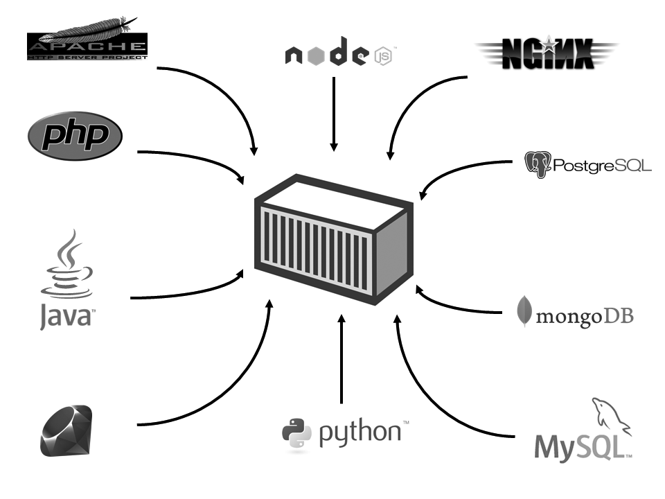

2010년을 넘어서면서 서버 시장은 급속히 클라우드 환경으로 옮겨갔다. 

클라우스 환경에서는 서버를 1대가 되었든 1000대가 되었든 클릭 몇 번 만으로 가상 서버를 
만들어 낼 수 있게 되었다.

생성된 가상 서버에 각종 SW를 설치하고 설정해야 하는데, 서버 갯수가 많아지면서 어려움을 겪게 되었다. 
리눅스/유닉스 환경에서 오랫동안 사용해왔던 쉘 스크립트로 설치 및 설정 자동화를 구현해도 되지만 이것도 한계가 있다. 쉘 스크립트로는 중앙 관리 기능이나 복잡한 기능은 구현하기 힘들다. 그리고 리눅스 환경은 설치해야 할 응용프로그램이 많고, 설정도 복잡하다. 특히 사소한 설정 하나가 OS와 서비스 안정성에 큰 영향을 끼친다. 

이런상황에서 Immutable Infrastructure라는 패러다임이 나왔다. (Immutable Infrastructure를 구현한 프로젝트가 Docker) 

Immutable Infrastructure는 호스트 OS와 서비스 운영환경(서버 프로그램, 소스 코드, 컴파일된 바이너리)를 분리하고 한번 설정한 운영 환경은 변경하지 않는다. 즉 서비스 운영 환경을 이미지로 생성한 뒤 서버에 배포하여 실행한다. **이때 서비스가 업데이트되면 운영 환경 자체를 변경하지 않고, 이미지를 새로 생성하여 배포하는 것** 

Immutable Infrastructure장점  
1. 편리한 관리 : 서비스 운영 환경을 이미지로 생성했기 때문에 이미지 자체만 관리하면 된다. 
2. 확장 : 이미지 하나로 서버를 계속 찍어낼 수 있다. 
3. 테스트 : 개발자의 PC나 테스트 서버에서 이미지를 실행하기만 하면 서비스 운영 환경과 동일한 환경이  구성되기 때문에 테스트가 매우 쉽다. 
4. 경량화 : 운영체제와 서비스 운영 환경을 분리하여 가볍고 어디서든 실행 가능한 환경을 제공한다. 

도커 로고를 보면 컨테이너 박스를 여러 개 싣고 다니는데, 서버에서 여러 개의 컨테이너(이미지)를 실행한다는 것을 떠올릴 수 있다. 또한 이미지 생성과 실행뿐만 아니라 이미지 저장과 배포(운반)도 의미한다. 

컨테이너에 물건을 싣는 것처럼 서비스 운영에 필요한 모든 요소를 모아 Docker 컨테이너에 넣는다. 자주 쓰이는 오픈소스 SW는 물론, 직접 만든 프로그램도 넣을 수 있다. 

현재는 리눅스 전용 

라즈베리 파이-Docker 
1. http://blog.xebia.com/2014/08/25/docker-on-a-raspberry-pi/ 
2. http://blog.hypriot.com/getting-started-with-docker-on-your-arm-device/

도커강의 
https://www.youtube.com/watch?v=Bhzz9E3xuXY