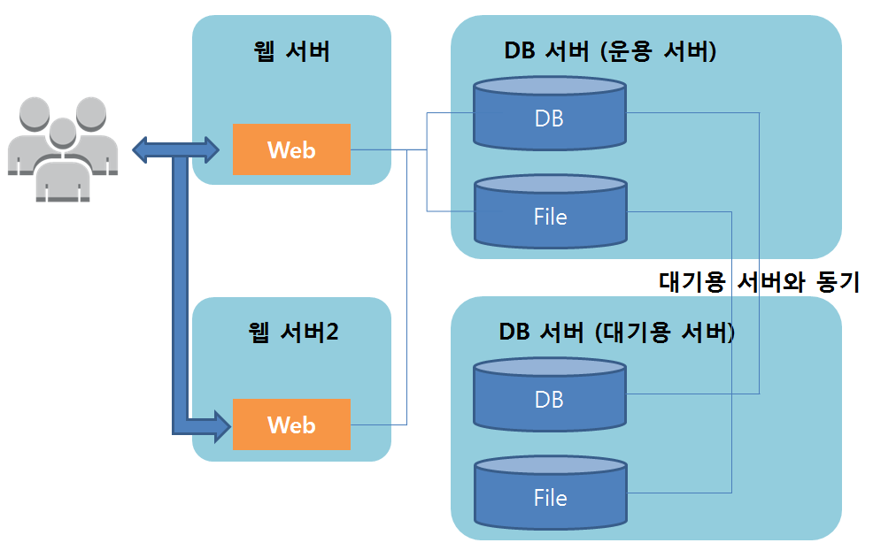

##시스템 구성 변경의 기초 

**패턴1 : 웹서버 x1, 데이터베이스 서버 x1 구성** </br>

**패턴2 : 웹서버 x2 구성 -다중화**</br>

이 구성은 다중성을 높이기 위해 적용하는 경우가 많다. 서버1에 어떤 문제가 생긴 경우, 서버1 대신 서버2를 이용하는 방법이다. </br>
이때 현재 운용 중인 서버와 대기용 서버 간의 전환 방법은 다음과 같이 다양하다. </br>
```
물리적인 서버의 경우, LAN 케이블을 바꿔 끼운다(수 시간)
DNS를 갱신한다(수 분 ~ 수 시간)
대기용 서버의 IP 주소를 수동으로 갱신한다(수 분 ~ 수 시간)
대기용 서버의 IP 주소를 자동으로 갱신하는 제품을 도입한다(수 초 ~ 수분)
그 밖에도 로드밸런서를 별도로 준비하는 방법이 있다
```
전제조건으로 DB와 File은 어떤 방법으로든 데이터를 동기화 해야하며, 그 방법은 다양하다 </br>
예를 들면, DBMS의 기능을 이용하거나 공유 스토리지(HW 및 SW)를 이용하는 방법이 있다 </br>

또한, 동기 방식으로는 완전 동기, 비동기 등이 있기 때문에 설계할 때 특히 주의해야 한다. 완전 동기는 성능을 높이기 어렵고,비동기는 성능을 높이기 용이하지만 비동기 특유의 동기 방법에 주의할 필요가 있다.</br>

참고로, 데이터 동기의 방법으로서 하드디스크 자체를 공유하는 방법도 있지만 전용 디스크 장치 및 케이블 등이 필요하게 되므로 가격이 매우 비싸진다. 따라 웹 계열의 시스템에서는 잘 사용하지 않는다. </br></br>

**패턴3 : 웹서버 x2, 데이터베이스 서버 x1 구성 - 다중화, 기능분할, 스케일 아웃**</br>

이 구성은 패턴 1에서 Web 측의 성능 문제가 해결 되지 않을 때 적용하는 경우가 많다.</br></br>
Web은 시스템의 동작을 일일이 계산해서 처리하게 되며, 사용자 수에 따라 처리량이 증가되기 쉽다. 따라서, Web과 DB를 별도의 서버로 나누어 분업시킴으로써 서버의 리소스 편중에 따른 성능 저하를 피하고, Web서버도 2대로 나누어 사용함으로써 시스템 전체의 성능을 향상시킨다. </br></br>
하지만, 1대의 서버로는 감당할 수 없을 만큼 액세스 수가 많은 경우, 2대의 구성에서는 1대가 고장 나면 또다시 처리 능력이 부족하게 되므로 가용성 관점에서는 여전히 문제가 된다.</br></br>

**패턴4 : 웹서버 x2, 데이터베이스 서버 x2구성 - 다중화, 기능분할, 스케일 아웃**</br>

이 구성으로는 Web의 다중화와 부하 분산 그리고 DB의 다중화를 할 수 있다. </br>

참고로, 대기용 서버의 DB에 대해 참조 SQL을 발행하여 데이터를 취득하는 것은 가능하지만, 부하의 관점에서는 의미가 없으며 가용성이 떨어지기 때문에 사용 하지 않는 것이 좋다. 

현재 운용 중인 서버만으로 처리하기 어렵다면, File을 별도의 서버로 분할 하여 대기용DB(slave)를 3대 이상 준비하는 등의 대책을 수립하는 것이 좋다. 

**내가 구축한 웹 서비스 시스템 구성도 **

EC2스펙은 t2.micro이고 CPU사용률 80%이상 시 CloudWatch가 감지하여 AUto Scaling하였다.</br>
최대 EC2 인스턴스 3개로 제한했다.

최소한으로 사용한다고 설정했는데 EC2 AutoScaling기능과 RDS에서의 Read Replica기능 때문에 
꽤 많은 요금이 청구되었다. </br>
P.S Route53의 $0.51은 도메인 등록 시 청구되는 요금


부하분산(로드밸런싱)의 기초 지식  
