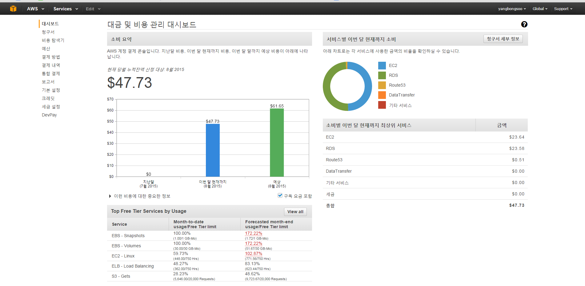

**시스템 구성 변경의 기초 **

패턴1 : 웹서버 x1, 데이터베이스 서버 x1 구성 </br>

패턴2 : 웹서버 x2 구성 -다중화</br>

이 구성은 다중성을 높이기 위해 적용하는 경우가 많다. 서버1에 어떤 문제가 생긴 경우, 서버1 대신 서버2를 이용하는 방법이다. </br>
이때 현재 운용 중인 서버와 대기용 서버 간의 전환 방법은 다음과 같이 다양하다. </br>
```
물리적인 서버의 경우, LAN 케이블을 바꿔 끼운다(수 시간)
DNS를 갱신한다(수 분 ~ 수 시간)
대기용 서버의 IP 주소를 수동으로 갱신한다(수 분 ~ 수 시간)
대기용 서버의 IP 주소를 자동으로 갱신하는 제품을 도입한다(수 초 ~ 수분)
그 밖에도 로드밸런서를 별도로 준비하는 방법이 있다
```
패턴3 : 웹서버 x2, 데이터베이스 서버 x1 구성 - 다중화, 기능분할, 스케일 아웃</br>

패턴4 : 웹서버 x2, 데이터베이스 서버 x2구성 - 다중화, 기능분할, 스케일 아웃</br>

**내가 구축한 웹 서비스 시스템 구성도 **

EC2스펙은 t2.micro이고 CPU사용률 80%이상 시 CloudWatch가 감지하여 AUto Scaling하였다.</br>
최대 EC2 인스턴스 3개로 제한했다.

최소한으로 사용한다고 설정했는데 EC2 AutoScaling기능과 RDS에서의 Read Replica기능 때문에 
꽤 많은 요금이 청구되었다. </br>
P.S Route53의 $0.51은 도메인 등록 시 청구되는 요금


